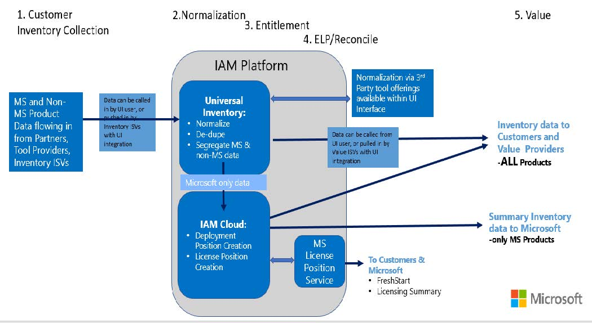
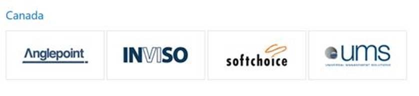
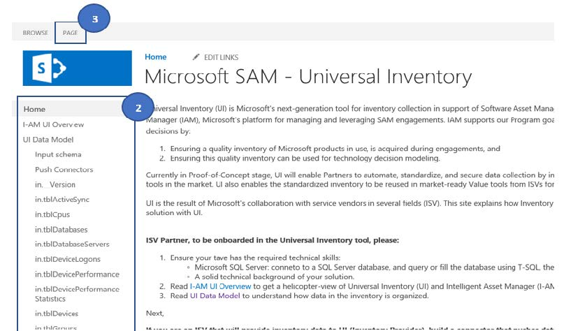
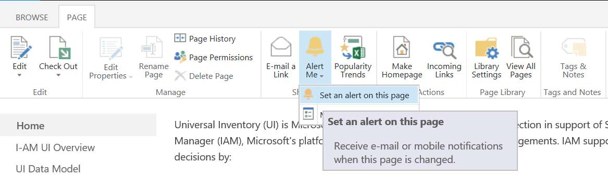
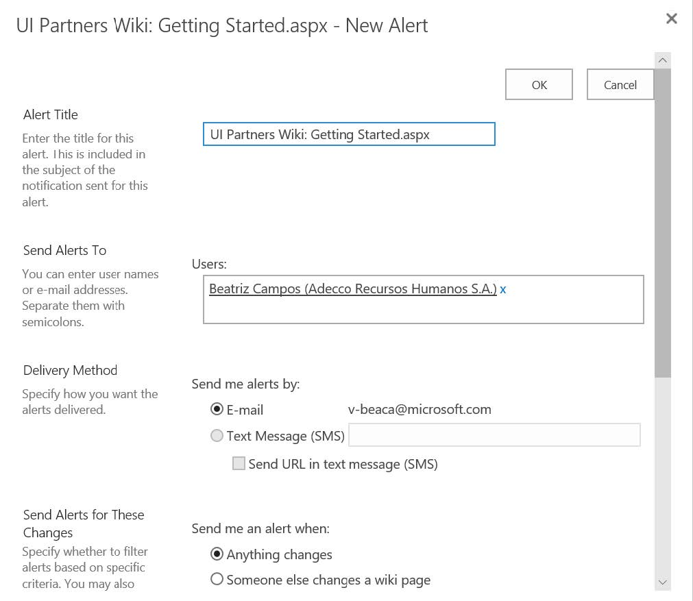
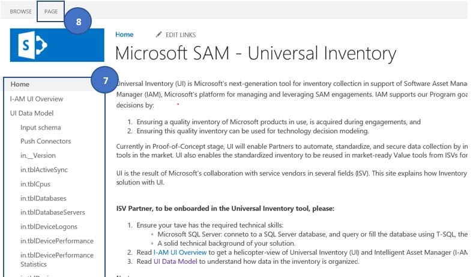
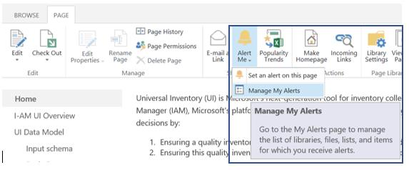
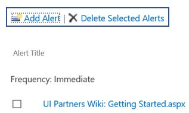

# Universal Inventory Integration for ISVs – Processes & Procedures v1.1. – June 2018

## Introduction

This guide explains the steps and process for ISVs to build connectors to <ins>Provide</ins> or <ins>Consume</ins> inventory data with the Universal Inventory (UI) component of the Intelligent Asset Management (IAM) platform.

This is a self-guided process and largely relies on <ins>*you*</ins>, the ISV to initiate the work and complete all the required steps. Please read and follow the processes contained in this guide.

IAM is a Microsoft Line of Business application that ensures Partners performing Software Asset Management engagements have a standardized process and workflow that ensures data quality, privacy and security controls are adhered to.

The core output of IAM is a standardized, centralized, de-duplicated view of Customer’s Microsoft Product consumption that is then used to help customers minimize IT risk, maximize value and achieve more with their IT investments.

Universal Inventory (UI) is a key component of IAM. UI is the engine that collects raw inventory files from a variety of sources, then ensures the completion of de-duping and normalization prior to sending to the cloud component of IAM for completion.

Data Flow in IAM across the 5 phases of SAM Engagements:

## ISV Commitment to promote Microsoft’s SAM Value Messaging

IAM 2018 is designed to facilitate achieving the core Microsoft SAM goals in delivering data driven insights that help customers increase the value of their Microsoft investments and make correct technology decisions.

Detailed information on Microsoft’s SAM objectives can be found here:

- [https://blogs.partner.microsoft.com/mpn/myth-busting-software-asset-management-andcompliance-audits/](https://blogs.partner.microsoft.com/mpn/myth-busting-software-asset-management-andcompliance-audits/)
- [https://www.microsoft.com/en-us/sam/default.aspx](https://www.microsoft.com/en-us/sam/default.aspx)

The IAM team will be promoting ISVs who have achieved UI integration points as part of the marketing of the platform. See request for Logo use below.

In order to be included in these promotions your UI integration work must include:

1. A dedicated landing page on your web site outlining the UI integration (within two clicks of your home page)
1. Information on how your users execute against this integration
1. Prominent promotion of Value substantively aligning to Microsoft’s SAM Value messaging

Examples of incorrect, non-aligned messaging would be:

- Any equating of SAM with Audit
- Use of the threat or implication of licensing incompliance to sell SAM deliverables
- Focusing on GAP identification and collection

The IAM team will discontinue work with any partner found to acting outside of these guidelines.

## Step by Step Processes

1. **Confirm to Microsoft your intent to proceed with the UI integration process by**:  
   **Sending an email to**: SAM-UI@microsoft.com with the following included:
   - Thoroughly reviewing the UI ISV process document
   - Company Name
   - Country
   - Primary contact name and alias for this work
     - Email alias must use a Microsoft Work or School Account
   - All additional contact names with alias’s who need access to the resources
     - All email alias’s must use a Microsoft Work or School Account
   - Whether your company will be a UI Data Provider, Data Consumer and/or Normalization

   A Microsoft representative will then reply confirming your access has been granted for the UI SharePoint Wiki page with all technical information regarding integration with Universal Inventory.

   - When you access the SharePoint: update the settings using the step by step instructions in the ‘Additional Information’ section below. This will ensure you receive notices about updated or changed content, including information on upcoming releases that may require technical updates to your integration solution.

1. **Review the UI integration instructions and complete tasks**:

    - Thoroughly reviewing the overview and technical documentation you have been granted access to at: [https://microsoft.SharePoint.com/teams/MS_SAM_UI/HQ%20Team%20UI%20Wiki/Getting%20Started.aspx](https://microsoft.SharePoint.com/teams/MS_SAM_UI/HQ%20Team%20UI%20Wiki/Getting%20Started.aspx)
    - Complete all the required technical tasks to integrate your solution with UI following the instructions contained in the SharePoint

1. **Get your results validated by the UI team: After you have completed your work and passed the self-validation tests**:

   **Sending an email to**: SAM-UI@microsoft.com with the following included:

   - If you are a Data Provider – include a copy of the validated Inventory database for Microsoft to test against
   - If you are a Data Consumer – Please indicate you have successfully integrated your solution and are able to retrieve UI DBs for use

1. **Microsoft will review your submissions according to the criteria established on the SP Wiki Pages**

   This validation work can take 1 calendar week. After validation is complete you will receive a Notification e-mail about the findings are some suggestions to improve your integration and make sure you are following the quality guidelines established by Microsoft. Once this refinement stage is done, you will be notified via e-mail.

1. **Send Microsoft your logo, use permission and link to more information**

   - Microsoft will ask via e-mail for some information to be able to include your logo and link on the official IAM 2018 landing page (aka&#46;ms/SAMIAM).
   - Respond to Microsoft’s request for Logo, Logo approval use and more information in substantially the same format as outlined below in Additional Information.
   - Supply a link or a copy of the directions you will supply to your end users on how UI integration works
   - Once received, Microsoft will add your logo into the official aka&#46;ms/SAMIAM list of UI integrated ISVs

   All operational communication after this time will be via SharePoint notices as Microsoft indicates future UI planning and updates that may require review or updates of your solutions.

   - Note: You may be required to re-validate results based on future UI updates.

## Additional Information

**For questions or comments on the IAM ISV integration process please email**: SAMUI@microsoft.com

More information on both Microsoft SAM Practices and IAM can be found in the Microsoft Partner Network here:  
[https://partner.microsoft.com/en-US/Licensing/software-asset-management#Navigated_Rich_Text_Node_11](https://partner.microsoft.com/en-US/Licensing/software-asset-management#Navigated_Rich_Text_Node_11)

**Examples of Logo use request sent from Microsoft to you for Logo approval templates:**

I was informed by our technical team that the &lt;&lt;insert company name&gt;&gt; application has passed the compatibility tests for integration with our Universal Inventory application.

Microsoft would like approval to use the &lt;&lt;insert company&gt;&gt; logo for inclusion on Microsoft&#46;com/sam website, Intelligent Asset Manager tab, under the IAM/Universal Inventory-compatible ISVs. A mockup of how we would like to use it is outlined below. If you will allow us to use the &lt;&lt;insert company&gt;&gt; logo, please reply to this email with your approval.

1. A high-resolution logo we can use on our webpage to confirm your compatibility with IAM2018. (In .ai format)
1. An email statement confirming your consent for us to use your logo on our webpage (Microsoft&#46;com/sam) and that you agree to the terms below.
1. A link to a webpage where people can find further information regarding your tools’ compatibility with IAM2018 and Universal Inventory

   - Download link for your application (or instructions on how to get it)
   - Versions/editions of your software that are compatible with UI/IAM
   - Training/guidance for how to export inventory data from your tooling to IAM2018 and/or how to import from IAM 2018 (user guides, videos, etc)

Example of how logo will be used:

Upon your email approval, and in addition to the approval granted above, Microsoft has the right to publish, use, reference and display the logo as follows: (i) on Microsoft’s internal and external websites; (ii) in printed and digital publications; (iii) in printed media distributed by Microsoft internally or externally; (iv) in slides, brochures and other marketing collateral materials; and (v) as a reference when communicating with analysts, the press and the general public. Termination for convenience: you may terminate Microsoft’s rights to use the logo specifically granted in this email at any time without cause by giving 30 days’ notice by email to IAMSupport@microsoft.com. For clarity, such email notice of termination will not affect Microsoft’s rights to use your company’s logos granted in any other agreement or arrangement between your company and Microsoft.

**How to update your SharePoint settings to receive email Alert Notifications:**

1. Access the [UI SP](https://microsoft.sharepoint.com/teams/MS_SAM_UI/HQ%20Team%20UI%20Wiki/Getting%20Started.aspx)
1. Click on the page on the left that you wish to set up an Alert Notification for any updates on the page. Note: you need to do this procedure for each page that you wish to receive notification
1. Click on the “Page” Button on top left

   

1. Click on “Alert Me” and then on “Set an alert on this page”

   

1. Set up the settings of how and when you would like the alerts to be sent. The default settings are recommended by the IAM team, so you will get an e-mail notification as soon as anything changes on the selected Wiki Page.
1. Click “OK”

   

1. Select the next Page that you would like to receive Alert Notification on the left menu and repeat procedure from 3 to 6
1. At any time, if you wish to manage or delete your alerts, click on the “Page”button on top left

   

1. Click on “Alert Me” and then on “Manage My Alerts”:

   

1. You will then find a list of all your set up alerts and the options to Add or Delete any:

   