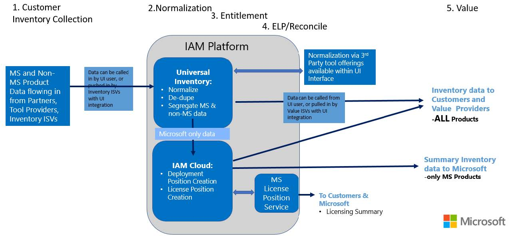

# Introduction: IAM 2018 Data Flow

The data flow within IAM 2018 by SAM workflow is displayed in the picture below. It is critical to understand:

1. Only Microsoft inventory data is sent to the IAM Cloud.
1. IAM includes security measures to help protect the data and privacy of Customers and their employees. Details of this can be found in the [IAM 2018 Data Usage and Privacy Information](https://aka.ms/iamdatausage)  document.

