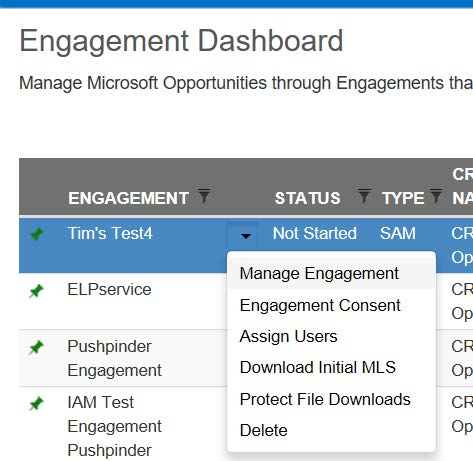
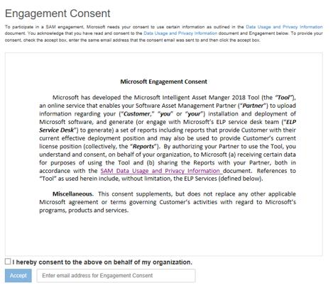
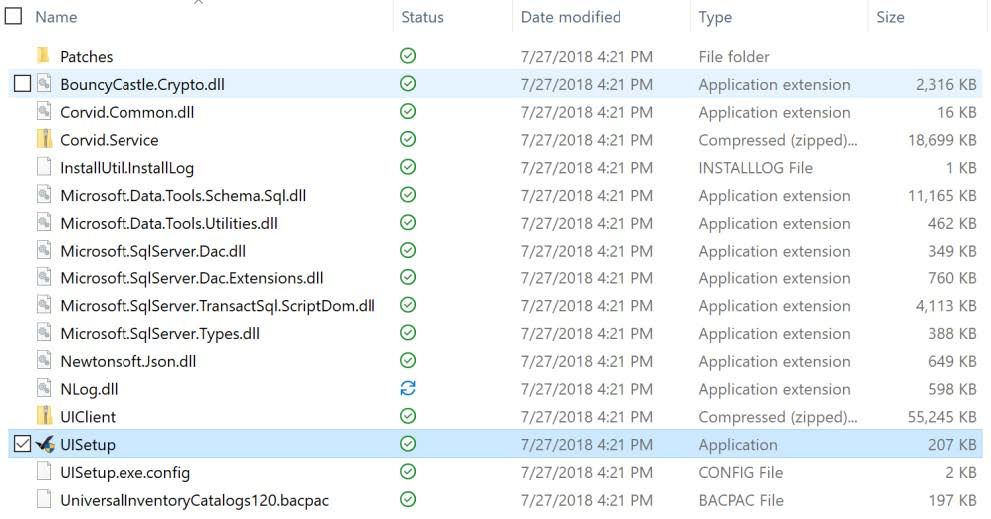
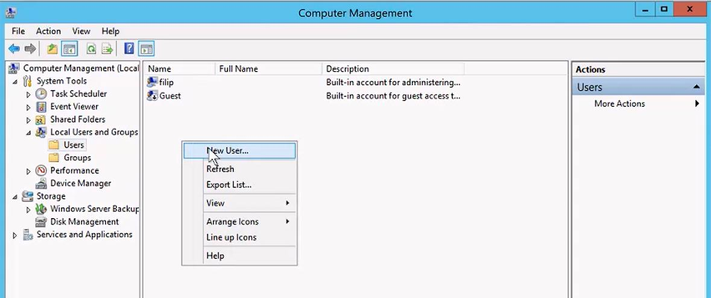
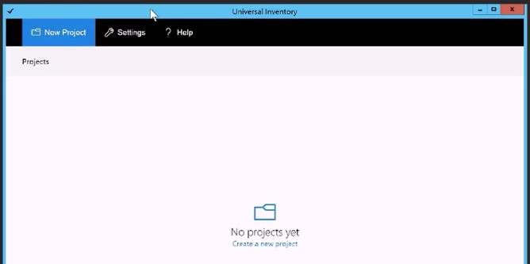
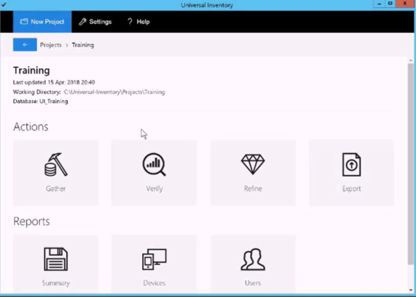
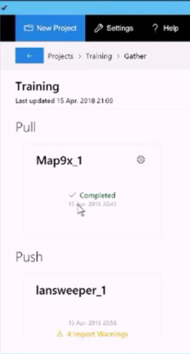
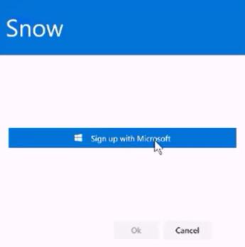

# Step 1: Pre-Processing

## 3.1 Creation of IAM Engagement

IAM Engagements are created by your SAM Engagement Manager (EM). To be created, you will have to provide to your SAM EM the following:

- Customer Name
- Copy of signed Letter of Engagement
- Connect ID (Partner Lead)

For the SAM EM audience, the appendix includes detailed instructions on how to create an IAM Engagement.

## 3.2  Customer’s Engagement Consent

All new Engagements require an Engagement Consent form to be signed by the person at the Customer who has <ins>authority to authorize a SAM Engagement</ins> ‘contact’. IAM Cloud will not accept a CIDC until this consent has been received.  
To send an Engagement consent via email to this contact, sign into [IAM Cloud](https://www.intelligentassetmanager.com/), select the “Engagement Consent” option in the caret dropdown for the Engagement.

Partner should select the correct “Engagement type” for this Engagement:

- "ELP as a Service” to be used only if an ELP will be created using [Microsoft’s Centralized ELP Service program](Step3_Effective_License_Position.md#microsoft’s-centralized-elp-service).
- "Partner Led” Engagement type: For all others

To choose the right Engagement type, click on “Edit” right next to the Engagement Type option, and select the preferred option. If you choose “ELP as a Service”, select on the first drop-down menu the option "SAM Live!" for ELP Service Provider, you do not need to choose any option for the "Quality assurance provider".

Next, enter the email address for the contact and click the “Send” button.

The contact will receive an email from iamc@microsoft.com with a link to consent to the Engagement activities.

The contact should then click on the link, which present the appropriate terms for the Engagement.

The contact will need to enter the email address used to receive the Engagement consent, check the acceptance language, and then click on the accept button.  
Partners and SAM EMs can review when and by whom consent was accepted by looking under “Acceptance Detail” on the “Engagement Consent” screen in the IAM Cloud  
After the consent has been received by the contact, IAM Steps 2 and 3 will be enabled for this Engagement.

If needed due to changes in roles, etc at the Customer, or due to choosing for the Centralized ELP Service later on the process, consent forms can be resent to alternative contacts or again to the same contact.

## 3.3  Best Practices for Quality Inventory Collection

Collecting complete and accurate inventory is the key to success to complete a SAM Engagement. In this section, we give some guidance on how to ensure this and meet the obligations defined in the [Value Engagements Statements Of Work (SOWs)](https://www.microsoft.com/en-us/sam/use-cases.aspx?CollectionId=9d33c0b2-7c54-4274-8b1c-d1dec3b8548d).  
Today, Customers are looking for ways to transform their business and embrace the digital era. Often, Customers have multiple data sources and use a set of individual point-solutions to manage them. Having a quality asset management discovery plan is key to the success of any Software Asset Management Engagement.  
Therefore, comprehensive data collection and an ability to create a complete and accurate Preliminary CIDC are critical for delivering the biggest value possible as the result of a SAM Engagement. A best practice suggested is that the first thing to do with the Customer is kick off meeting, which will be the most important one.  
During this meeting, partners should present the value of SAM and the process behind it. This meeting is also the time to establish an agreement on timelines and infrastructure needed to complete the Engagement. Partners should articulate which data will be extracted from Customers’ environment and why.  
Basic questions to ask during a kick-off meeting include:

- How many clients and servers are in the infrastructure?
- Do employees work remotely?
- Is there a dev environment?
- It is imperative that you learn how their infrastructure is architected, how many of their servers have been virtualized, whether they have workloads running on the cloud, and who manages it all.
- Where the Customer’s assets reside, and how you can access them.

During the data collection, if Customer is unable to provide access to certain devices, or datasets, you’ll need to investigate further. There’s a chance that these devices are compromised.  
It is a common scenario to run multiple types of data-scanning platforms, depending on what the Customer already uses and what is the Partner’s plan. It is best practice to bring in additional Customer data, like SCCM, Altiris, etc. The more datasets used, the better. However, for any option that you choose to run, we recommend running Active Directory and [MAP Toolkit](https://www.microsoft.com/en-us/download/details.aspx?id=7826) in tandem with your Customers’ asset management tools, reporting separately into Universal Inventory.  
If you opt to use [MAP Toolkit](https://www.microsoft.com/en-us/download/details.aspx?id=7826), ensure multiple runs in different moments in time multiple times a day, for a
few weeks at minimum. Focus on collecting both inventory data as well as additional performance data (this will facilitate value work). If value work will be done with the inventory data collected, we suggest having the performance counters run for 32 days for all Windows Servers. If MAP Toolkit is not run consistently, you will not get the quality data you need to execute a successful SAM Engagement.  
Finally, you will need to validate the data you collect. Some best practices are described below, they should become blocking factors that might stop you from creating a CIDC for your SAM Engagement.

- Uncover the number of physical core, processors, servers and workstations in your project scope.
- Uncover the number of virtual processors and virtual machines (VMs).
- All VMs must have an underlying physical server, so make sure all the tools you are using can provide the physical server information of virtual machines.
- Scan vCenter related data, even if this task is being executed in an outsourced environment and, after identifying this information, determine the CPU. This is critical to core-based licensing.
- For SQL server instances, it is required reference to a SQL installation.
- From physical machines and mobile devices, to hyper-visors and host-machines, make sure you have the manufacturers identified. Know that usually those should be names you can find on the internet. An indicator of incorrect and low-quality data is when a manufacturer is called “test” or a mobile “unknown”.

SAM Partners should cross check the quality points described above and review the Minimum EDP Quality Standard to see some ways Microsoft evaluates the quality of EDPs.

**Minimum EDP Quality Standard samples:**

| Data Standard:                                                                                         | More Detail/Examples:                                                                                                                                           |
|--------------------------------------------------------------------------------------------------------|-----------------------------------------------------------------------------------------------------------------------------------------------------------------|
| The EDP Data Tab should have a row for each product and version on each installed device.              | This standard leads to many data rows in the EDP. To get a basic sense of completeness, focus on Workstations - there should be 1 Workstation OS for each seat. |
| Cumulative Workstation volume should equal the approximate company workstation volume (PCs count)      | Check EDP Summary Tab for Workstation OS licenses or CIDC tab A                                                                                                 |
| Physical Core and Processor Count for physical servers and workstations must be ALWAYS greater than 0. |                                                                                                                                                                 |
| Virtual Processor Count for virtual Servers and workstations must be ALWAYS greater than 0.            |                                                                                                                                                                 |
| All Virtual hosts must have 1 underlying physical server                                               | Check the EDP 'Other Server' Worksheet for any product identified as 'unknown host' & correct as needed.                                                        |
| All devices (virtual, physical, hosted) must contain an actual Processor type                          | 'Unknown' or XXXXXXXX are not processor types. No generic character strings should be included.                                                                 |
| The data rows in SQL Instance Worksheet tab must equal the total in Summary tab.                       | CIDC tab F must contain SQL instance data.                                                                                                                      |
| All products with Royalty Free License Model must have a license count greater than 0.                 |                                                                                                                                                                 |
| Machine Manufacturer and Model must represent actual Manufacture & Model.                              | No generic character strings should be included - XXXXXXXX or 123123 are not actual mfr names.                                                                  |

Additionally, you can watch the video of the [IAM 2018 Session 1: Best Practices for Quality Inventory Collection](https://aka.ms/IAMSession1).

## 3.4  Installing Universal Inventory and Encryption/Decryption Tool

NOTE: The Universal Inventory service account has to have permissions to create and delete databases on the database server.

- Have a folder available where Universal Inventory can store Log and Project files.
- Have an URL and port available where the Universal Inventory service can be published.

NOTE: The Universal Inventory service is published on [http://localhost:10940](http://localhost:10940) by default. If you want to run the Universal Inventory client application on a different computer, you must replace localhost with a network name that the client computer can connect to.

1. To download the Universal Inventory, go to [https://aka.ms/downloadUI](https://aka.ms/downloadUI) and download the “UISetup” compressed folder. Extract the files contained on the folder and run the “UISetup” Application.

   

1. Once you finalize the installation of “UISetup”, it will install two different client apps on the computer:  
   Universal Inventory (IAM-UI) and the IAM Encryption/Decryption Tool (IAM-EDT).  
   NOTE 1: **The installation of UI must be done on Customers domain**, they can now directly download the UI Application independently of the SAM Partners via [https://aka.ms/downloadUI](https://aka.ms/downloadUI).  
   NOTE 2: UI must be installed on a machine with English Operating System if users want to be able to decrypt their EDP or ELP  
   NOTE 3: On UI v1.1 and the next versions, when UISetup Application is started you will now be able to run through three different options:  
   1. No UI previously installed on the machine: App will run you through the installation steps of the version downloaded.
   1. UI has already been previously installed and the version is the same as downloaded: App will show only the uninstall button.
   1. UI has already been previously installed and the version is lower than the download: App will show the uninstall and update buttons.

1. First, run the “UISetup” as an administrator by right-clicking it and choosing “Run as administrator” option, it is the safest way to install UI.
1. The Universal Inventory Setup windows will open and the first thing you will see is a list of the prerequisites needed. If you click on the “question mark” on the top right, you will be re-directed to an external page with more detailed information on these topics.

   NOTE: There are two core components for running successfully UI, SQL Server 2014 or later, Express Edition or higher and also SQL Management Studio. If you do not have them installed, follow the steps 5 to 13.

   

1. For starting SQL Server 2016 Express installation, click on the link available on the UI window (under the second bullet) to download it.
1. For installing SQL Server 2016 Express, run the Application downloaded. Select the installation type (Basic/Custom), then choose the directory for extracted files and an download of the installation files will start.
1. Once it is successfully downloaded and installed, the Remote Desktop Connection window will appear, select the first option “New SQL Server Stand-alone installation”. Accept the application terms and run the installation.

   

1. When you reach to the “Feature Selection” step, select only the core component “Database Engine Services”. All the other features available are not necessary for the installation of UI.

   

1. On the “Instance Configuration” step, name the “Named Instance” as “Universalnvent” or any other easily-identifiable name, press “Tab” and the “Instance ID” will be automatically populated and then click on Next.

   

1. On the tab “Server Configuration”, verify your Service Accounts and Passwords, if necessary, and on the “Collation” tab, you should add “SQL_Latin1_General_CP1_CI_AS” as Database Engine to make sure it takes into account characters that are commonly used outside the standard English speaking regions.  
   NOTE: This Collation definition is important also for other Microsoft components such as System Center Configuration Manager and others.
  
   

1. On the next tab, “Database Engine Configuration”, select the appropriate Authentication Mode, we recommend the first option “Windows authentication mode”. Review also the SQL Server administrators, if will as default suggest that you use the Windows logged-on user.

     

1. Proceed to the next step to get the Installation running and completed. Review if all the features are correctly installed and shown as “green” and close this window. This concludes the SQL Server 2016 installation.

   

   NOTE: It is recommended independently of the edition/version of the SQL Server you choose to use,provided that it follows the UI pre requisites, that the [SQL Management Studio](https://docs.microsoft.com/en-us/sql/ssms/download-sql-server-management-studio-ssms?view=sql-server-2017) is installed, to be sure you can connect in the right way to the different databases available on the system (since for SQL 2016 and higher you need the most recent Management Studio for loading the core Universal Inventory datasets).

1. After downloading and running SQL Management Studio installer Application, you will see the black window shown below. Click on “Install”. The installation will then run, once it is completed you will be requested to restart the computer to finalize the setup.

   

1. Now, going back to the UI installation, open the “UISetup” Application again by right clicking it and choosing “Run as Administrator”. Click on “Next” and you will see a checklist with a validation of the prerequisites. If all of them are green you will be able to proceed to the next page.

   

1. You will then need to provide a user name that can be used for the UI Service Account. If you click on the “question mark” on the top right, you will be redirected to an external URL with more information about this Service Account configuration.

   

1. To create a Service Account through the local user’s database open “Computer Management” panel under your Windows search bar. Open the drop-down menu on the left for the “Local Users and Groups” and select “Users” folder. You should then right click on the blank space and select “New User”.

   

1. You will then be prompted to fill out information about the Service Account. Note that password must follow the organization’s password policy. Also, select the options “User cannot change password” and “Password never expires”, to avoid future issues with the Service Account. Click on “create” when done.

   

1. You should know that it was created successfully once you see the user on the user list, such as below.

   

1. Now going back to the UI interface, populated the Service Account username and password and click on “Verify”. The pop-up window should confirm that the Service Account has been granted the Logon as a service permission.

   

1. Before moving to the next stage of UI installation, you need to configure your Service Account as a system administrator for it to be able to logon to the database server. To do so, you will need to use the SQL Management Studio previously installed. When you open the application, in most cases it will automatically verify the Server Name you created for UI, in this case named “UniversalInvent”. If not, select the correct server name and click on “Connect".

   

1. You will then see a menu on the left hand-side, open the “+” sign on “Security”. Right click on “Login” right below it and click on “New Login”

   

1. Type in the Service Account name (in this case, “UI-Service”) and click on “Search”.

   

1. Re-type the Service Account name on the box and click on “Check Name” and then on “OK”.

   

1. Now, select the “Server Roles” on the menu on the left and select also the “sysadmin” role for this Service Account, click on “OK”. You can now close the SQL Management Studio application.

   

1. On the UI interface, now under Database Server configuration step, you will be prompted to provide the Server Name (sometimes it could be the local machine). For this case, it is the name used when installing the SQL Server 2016 (“.\UniversalInvent”). Select the Authentication Mode, type in the Service Account username and passwords and click on “Verify”. If all is correctly configured, you should see the checkmark on the left for the Database Server. Now, click on “Next”.

   

1. At the “Work Folder” stage, you will need to select a folder where all UI scripts, logs and other files will be stored. Click on “Select Folder” to choose the location. Look for the checkmark on the left to ensure it is configured correctly and click on “Next”.

   

1. On the next screen you will need to select the correct ports that the system will use for communication.This step is necessary because one could have different configuration set-ups such as running everything locally or having another server connecting to UI using one specific port. If the Customer wants to have another port defined that is not the default one (localhost:10940), that is okay. Click on “Verify”, make sure the check mark is shown under the URL stage and click on “Next”.

    

1. Review the components Summary and click on “Install”. UI will only start changing configurations of the system once this “Install” button is pressed.
1. Now UI will create the database on the database Server and Instance, which contains an UI central data store and an additional store with configuration parameters, also will install and, by default, when you click on “Exit” it will launch the UI Client application.

   

   NOTE: If you get a “You are not connected” error when the UI Client Application is launched, you will need to validate that the connection settings are correct. To do so, click on “Settings” and make sure that the connect address and port are the ones you specified during set-up and click on “Test”. If you see in green “Connection Successful” it means that you are all set. Click on “OK”. You will then be prompted to restart the UI Client application. Once it restarts, you will see a screen showing that you have no projects created.

   

   Now you are all set up to start creating a CIDC using Universal Inventory.

   Additionally, you can watch the video of the [IAM 2018 Session 2: Installing Universal Inventory](https://aka.ms/iamsession2) (this recording still uses the first version and look-and-feel of UI, but the workflow remains correct).

## 3.5  Creating a Clean Inventory Data Contract (CIDC) with Universal Inventory

The Clean Inventory Data Contract (CIDC) is an Excel report used as the required template to pull in and consolidate raw inventory data from the various inventory and discovery tools, de-duplicated, and formatted to work with the main IAM site. Some manual usage and license allocation inputs will also be required to complete the CIDC. Once uploaded, the CIDC is validated against business rules to ensure proper data collection. If the CIDC fails validation a CIDC Error report detailing what needs to be fixed will be created.

1. On the Customer’s machine, open the Universal Inventory client application that was just created. It will launch with a standard blank screen because no Projects are defined yet. With this solution the Customer can create multiple projects for themselves, UI can be a component to be used without any specific Microsoft Engagement running.

   

1. Click on “New Project”, type in the Project name and click on “Save” button. The system will create the Project database, taking into account the data stored in UI database as a starting point. You know the Project was created successfully when you see this screen:

   

1. Click on “Open Project” and you will see standard interface with the Actions and Reports that can be performed through UI.

   

1. Click on “Gather” to configure the data sources that need to be configured for this Engagement. To add new data sources for an Engagement you currently have to options:
    - Use a “Pull Connector” to reach out to the data sources maintained by Microsoft (Active Directory, MAP Toolkit, SCCM 2012 and/or vMWare vCenter (Office 365 will be added shortly); OR
    - Use to “Push Connectors” to automatically push the data scanned through the Inventory Tools/Services from the UI-integrated Vendors (ISVs).

1. For the first option of a “Pull Connector”, click on “Add” button and choose which data source is preferred:

   

1. This guide will showcase a MAP Toolkit integration as a data source, so click on “Add” under the MAP Toolkit option. Type the Sever name that contains the MAP data base instance and select the type of Authentication. Then, click on the blue Refresh button and the system will update with all Database names contained in this server under the “Database” drop-down menu. Select the preferred one. As an option, you can also define the “Tenant/Site” name. This is useful when more than one MAP database is included, so that later reports can be run for a specific Tenant from a MAP database. Click on “Add”.

   

1. A “Pull” connection will be created. Click on “Run” to pull the database from this source, you will see the status change to “Complete” in green, which means this selected environment was scanned and pulled into UI.

   
   

1. Go back to the Project dashboard and this time select “Verify” to check a list of information about the devices scanned.

   

1. At the Verify tab, you will notice some options available for checking the database imported. On the “Column” filter, you can select which columns you would like to see on the report. To exclude certain parameters on both Devices and/or Users from your final CIDC file, select the row by clicking on the blue “Checkmark” on the left portion of the and then click on “Exclude” under the “Action” drop-down.

   

1. In case you wish to add a “Push Connector”, within this guide we will show you an example of how that can work through the LanSweeper UI-integrated application since they were one of our first Tool Partner to integrate with UI. When the LanSweeper application is ran, the start screen shows an option to Export the inventory to Universal Inventory.

   

1. Fill out the information related to your Universal Inventory server created and follow the steps within their application. The correct “Connect to Universal Inventory” Database name to be used is displayed on the Project Dashboard (see example below). Also, the Datasource ID should be provided by Lansweeper. Click on “Connect” and then on “Start” and the Push connector will start working to push your Lansweeper scanned data into your Project created within UI.

   
   

1. Once the export is completed it will be communicated through a pop-up window and you can finalize this process by clicking on “Ok”.
1. To verify if your data is now available on your UI Project, go back to “Gather” option on the initial Project dashboard and verify that the “Push” inventory is available.

   

   NOTE: If you see that any of the data sources included on your Project contain “Import Warnings” in yellow, it means that your data is missing important data points that will ensure a minimum quality standard on your CIDC. Click on the yellow message to read more information about which data is missing. Make sure that data is corrected before creating your CIDC so that you comply to these minimum standards recommended by Microsoft.

1. Once you have finalized pushing and pulling from all the data sources you used to scan your Customer’s environment, you can verify all the data included in UI through the 3 different Reports available on the Project dashboard. Once you are certain that the data from the Push and Pull connectors are correct and all the right Devices and Users are available, you should proceed to the Refinement step, accessed through the “Refine” button on the Project dashboard.

   

   Refinement step, also known as “normalization”, de-duplicates and normalizes product naming from the various disparate inventory data collection solutions. Inventory collection tools contain their own product naming standards, and in order to have one single inventory format standard, refinement merges these into a single, standardized universal dataset that is easily to understand.  
   For IAM 2018, Microsoft is partnering with leading SAM Tools providers who have demonstrated best practices within their refinement/normalization solutions to offer no cost services for Engagements being processed through IAM. Refinement service offerings will expand over time. Refinement service providers may have their own set of Terms and Conditions for users.

   The IAM 2018 launch partner for Refinement is Snow Software. To learn more about Snow’s normalization solution, [click here](https://www.snowsoftware.com/int/solutions/data-normalization-cleansing-0).

   During refinement, a very limited amount of data collecting during inventory gathering is shared. Data fields that could contain PII are not transmitted. This table contains the data sent during refinement:

   | Data send for refinement | Example of data                  |
   |:--------------------------:|:----------------------------------:|
   | Software vendor          | Microsoft Corporation            |
   | Application path         | c:\program files\test\office.exe |
   | Application name         | Office 2013 Professional         |
   | File size                | 12000 mbs                        |

1. Click on “Refine” under the Snow service that is shown as available.

    

1. Because it’s a no-cost service, you will need only at the first time do a short registration at Snow’s application. Click on “Sign up with Microsoft” and you will be requested to sign up with your Microsoft Work or School Account (Office 365 or Azure). You will then be redirected to a screen to type your Account and Password and then click on “Sign in”.

   

1. The next screen will request your consent to forward your UI identity to Snow Software on the normalization App that you will be using. Read the terms on the window and click on “Accept”. You will then see that the UI application has been granted the necessary rights within the Snow’s normalization application and click on the green big “checkmark”.

   
   

1. Fill out a quick registration regarding your Customer and click on “Submit”. Read the Snow’s End-User License Agreement and click on “Accept” to finalize the set-up for the normalization service from Snow.

    

    

1. When the refinement is finalized by Snow’s application, a data timestamp will show on the box, as well as the green “Completed” note. NOTE: When you have products that are not recognized immediately by Snow, those are processed by Snow’s normalization team and made available on the UI app within the next 24 hours.
1. To check on the normalization work that has been completed, go back to the main Project dashboard and click on “Summary”. On the report, you will see the “Distinct software titles and versions” as the total count within the raw data and “Normalized software titles” with the total count after the normalization process.  
   NOTE: You can also see the reports “Devices” and “Users” for more detailed information about them.

   

1. To finalize your inventory collection for a Microsoft SAM Engagement, you need to create the Universal Inventory CIDC. Click on the “Export” button on the Project dashboard and you will see the option to create a Microsoft CIDC. The system will then build the CIDC file and prompt you to select a location for it to be stored. NOTE: Only Microsoft-related licenses will be exported to this CIDC file. It is the same file that will later be encrypted and uploaded into the IAM platform to finalize your Microsoft SAM Engagement.

   
   

1. If any of your data sources are missing important data, on this screen you will find an error messages with some information about the missing data. If you click on the “Description” for each item, you will see a list of the Devices that contain that specific error. These are important indicators that your inventory is not following the minimum data quality requirements that Microsoft recommends, so it is especially important that you fix them before moving forward with your CIDC creation.

   
   

1. Once you find that your CIDC has sufficient data quality and is ready to be included on IAM for EDP and/or ELP creation, you should open the IAM Encryption/Decryption tool that was installed along with UI_Setup to encrypt your CIDC data. Launch the tool and fill in the “Source CIDC File” by browsing your document on the location it was saved. Then you will have to determine a Password for your CIDC, so the data will only be available for the ones that have this password. Click on “Encrypt” and the CIDC encrypted file will be created in the same folder as the source file, with the same name suffixed with “-Encrypted”.
   - Guideline for CIDC password:
        - At least 8 characters long;
        - Include 3 of the following four below:
           - Uppercase
           - Lowercase
           - Numbers
           - Symbols or Unicode characters

           

1. If you need to decrypt your CIDC, EDP or ELP to visualize the data, on the box “Decryption”, select the Source File and type the same Password used for encryption. Select the file type in the drop-down menu and click on “Decrypt”.

   

1. Additionally, going back to the Universal Inventory app, on the “Export” option in the main dashboard,you will also find other options to export, which are the UI-integrated Value tools that are provided by our Tool Vendors. Our launch partner in providing this integration is UnifyCloud with their CloudRecon Analytics service, that generated Value Engagements reports. When you click “Export”, you will download a backup of your UI database in the standardized UI format that can be uploaded into CloudRecon.  
  NOTE 1: CloudRecon licenses might be required for using this service.  
  NOTE 2: To be able to create a Value Engagement report, CloudRecon will require a full picture of the Customer’s IT environment, not only Microsoft-related licensing information. Therefore, this CIDC downloaded will contain all manufacturers data information.

    

   Once the CIDC is encrypted you are ready to upload to the Intelligent Asset Manager Platform to run through Steps 2 and 3.

   Additionally, you can watch the video of the [IAM 2018 Session 3: Creating a CIDC Using Universal Inventory](https://aka.ms/IAMSession3).