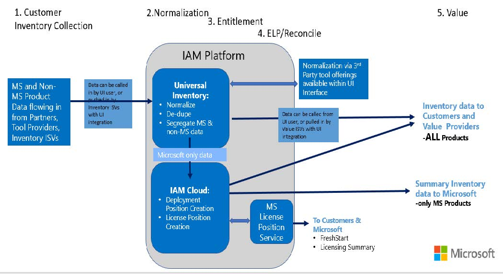

# Overview: Intelligent Asset Manager

[**Intelligent Asset Manager**](https://aka.ms/SAMIAM) (IAM) is Microsoft's next-generation platform for [**Software Asset Management**](https://www.microsoft.com/sam) (SAM) best practices. IAM helps organizations make good data-driven technology decisions by maintaining a quality and standardized inventory of software products in use, independently of the inventory tool used*. It also ensures [**Microsoft SAM Partners**](https://www.microsoft.com/sam/programs-sampartner.aspx) performing [**SAM engagements**](https://www.microsoft.com/sam/programs-engagements.aspx) have a standardized process and workflow that ensures data quality, [**privacy**](https://privacy.microsoft.com), security and [**GDPR**](https://www.microsoft.com/it-it/trustcenter/privacy/gdpr) controls are adhered to.

**As long as they have finalized integration with IAM.*

IAM consists of the following components:

- [**Universal Inventory**](UI.md) (UI) is a free application you can install on-premise to gather, process and standardizes inventory data about the entire IT infrastructure of an organization. UI does not scan the IT infrastructure, but rather integrates with existing solutions to import data from sources such as the Active Directory, well-known discovery tools, asset management solutions, virtualization systems, and cloud subscriptions, and stores the consolidated inventory in a database on-premise. The core output of UI is the Clean Inventory Data Contract (CIDC), which can then be exported into one of the [**Value solutions integrated with UI**]() or into the IAM Cloud during a Microsoft SAM Engagement (see below).

- [**IAM Cloud**](IAMCloud.md) is a cloud service hosted by Microsoft. During a Microsoft SAM Engagement run by a SAM Partner, Microsoft-only software deployment data consolidated through UI in a CIDC can be uploaded to IAM Cloud to produce the Microsoft-certified Effective Deployment Position (EDP) and Effective License Position (ELP). At this moment only Microsoft SAM Partners have access to IAM Cloud.

## IAM Data Flow

During a Microsoft SAM Engagement, the data flow within IAMis displayed in the picture below. It is critical to understand:

1. Only Microsoft software inventory data is sent to the IAM Cloud, therefore, to Microsoft. While solely using UI no customer data is shared with Microsoft.
1. IAM includes security measures to help protect the data and privacy of Customers and their employees. Details about this topic can be found in the [**IAM Data Usage and Privacy Information**](https://aka.ms/iamdatausage) document.

## Getting Started with IAM

- Learn more about [**Universal Inventory**](UI.md) and how it works.  
- Learn more about the [**IAM Cloud**](IAMCloud.md) and how it works.
- Get to know all about the [**Key IAM Users and Stakeholders**](key-users.md). Identify which User category you are a part of and follow the correspondent Quickstart and Tutorial guides to learn how to use the IAM features available for you.