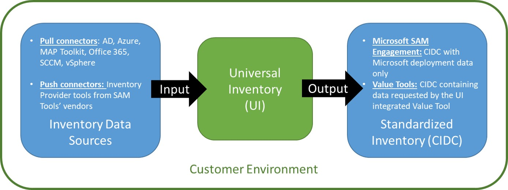

# Overview: Universal Inventory

[**Universal Inventory**](https://aka.ms/downloadUI) (UI) is a free application you can install on-premise to gather, process and standardizes inventory data about the entire IT infrastructure of an organization. UI does not scan the IT infrastructure, but rather integrates with existing solutions to import data from sources such as the Active Directory, well-known discovery tools, asset management solutions, virtualization systems, and cloud subscriptions, and stores the consolidated inventory in a database on-premise. The core output of UI is the Clean Inventory Data Contract (CIDC), which can then be exported into one of the Value solutions integrated with UI or into the IAM Cloud during a Microsoft SAM Engagement (see below).

This workflow is better showcased on the picture below.

It is important to note that all UI dataflow occurs inside the environment of the organization that is analyzing its IT environment (most commonly named as "Customer", or "End-customer"). As far as an official Microsoft SAM Engagement go, only Microsoft software data collected will be transferred to Microsoft, which is explained more thoroughly on the [**IAM Cloud overview**](IAMCloud.md).

## UI Input: Inventory Data Sources

As an input into the UI application, it is accepted several different types of raw inventory data sources. It could come from either push or pull connectors (described on the picture above).

To check on the official list of UI Inventory Providers Tools, visit the [**official IAM page**](https://aka.ms/samiam).

## UI Processing

Once the software deployed on the organization's IT environment is successfully scanned* by the data sources selected from the options above, user will be able to input it into the UI application.

The workflow below outlines the UI processing of the input data:

- Gather: Inputs the raw data scanned by the data sources described above into UI
- Verify: Allows user to exclude out-of-scope items
- Normalization/Refine: Translates discovered data into normalized and standard product names
- Export: Allows export of standardized inventory data to both Microsoft and other value service providers using Microsoft's Clean Inventory Data Contract (CIDC) format
- Encryption/Decryption Tool: App installed along with UI that allows encryption of the CIDC PII data before sending it to Microsoft through IAM Cloud

**It is recommended to read carefully the [**Best Practices for Quality Inventory**](../Tutorials/UI/quality.md) Tutorial when performing the inventory collection/scanning. The best way to ensure great value analysis and consequent most efficient IT business decisions based on a SAM Engagement is making sure the raw data used for these analysis are of the highest quality possible.*

## UI Output: Standardized Inventory (CIDC)

Once the UI inventory is complete and standardized through the normalization process, the user will be able to export the inventory (CIDC) file with the exact correct data for the purpose it will be used to: Microsoft SAM Engagement or other Value/Visualization Tools that have integrated with UI.

To check the official list of officially integrated UI Value Tools, visit the [**official IAM page**](https://aka.ms/samiam).
