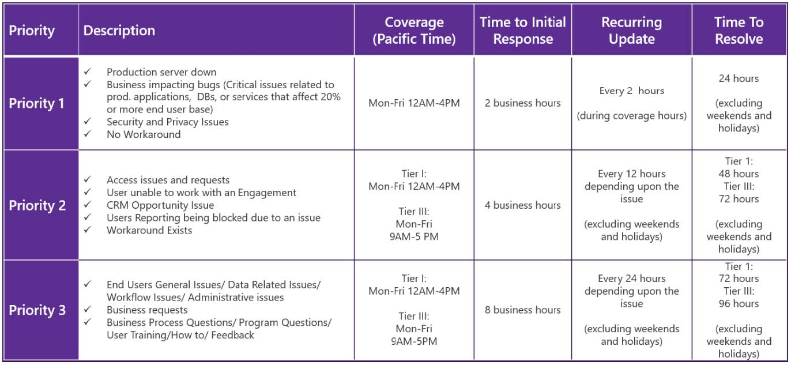

# Intelligent Asset Manager Support and Community

## IAM Cloud and Universal Inventory Support

All technical support issues regardinf both Intelligent Asset Manager, Universal Inventory and IAM Cloud should be directed to IAMSupport@microsoft.com.
  
The following overview summarizes IAM support standards:

## Intelligent Asset Manager Community Platforms

If you would like to connect with other members of our IAM Community, Microsoft's IAM team, other SAM Partners and ISVs working on UI integration, we recommend checking on Intelligent Asset Manager forum at the [**Microsoft Partner Community**](https://www.microsoftpartnercommunity.com/t5/Intelligent-Asset-Manager-2018/ct-p/PartnerConnect_SAM_WorkSpace) platform. It is constantly monitored by the IAM team and if you choose to **subscribe to the folders**, you will receive e-mail notifications as soon as IAM updates and news are posted to the platform!