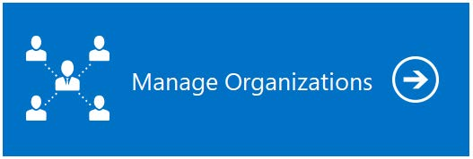
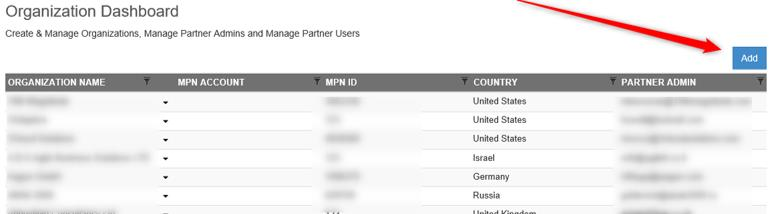
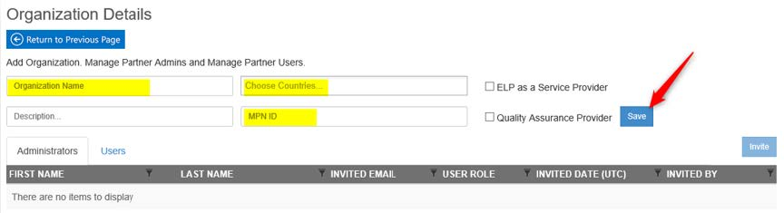
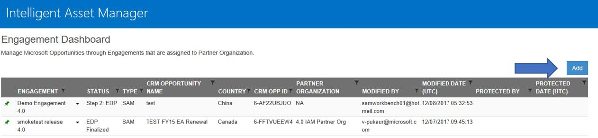
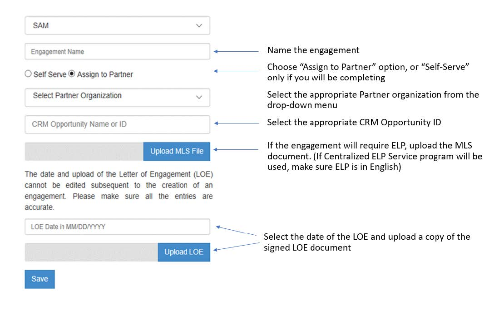

# Tutorial: IAM Cloud for Microsoft SAM Engagement Manager (EM)

This tutorial section covers the IAM Cloud administrative tasks a Microsoft SAM EM should know of in order to support their SAM Partners to deliver a Microsoft SAM Engagement through Intelligent Asset Manager.

>[!TIP]
> It is ideal to review the first steps to onboard a SAM EM into IAM, which are outlined on the [SAM Engagement Manager Quickstart](../../Quickstarts/SAM-EMs.md) section.

## IAM Cloud Requirements

- Microsoft Excel 2007 or higher
- Connection to the internet
- Have a Microsoft Account with access to Intelligent Asset Manager

## User Types and Provisioning

There are currently 2 different types of users with elevated Admin permissions to IAM platform:

- **Geo Admin***: Responsible for creating Partner Organizations and inviting SAM Engagement Managers located in their Subsidiary/Country. They can also complete the Engagement workflow if no Partner is involved in the Engagement.
- **SAM Engagement Manager***: Microsoft resource responsible for creating Partner Organizations and assigning new Engagements to Partner Organizations. They can also complete the Engagement workflow if no Partner is involved in the Engagement.

There are currently 2 different types of users within a Partner Organization on IAM Platform:

- **SAM Partner Admins***: Responsible for managing (add/delete) SAM Partner Users, assign users to the Engagements and manage Engagements within their Partner Organization. Specific to SAM roles and responsibilities but can complete any type of Engagement assigned to the Partner Organization.
- **SAM Partner Users**: Assigned by the Partner Admin, can manage Engagements within their Partner Organization and complete IAM workflow tasks. Specific to SAM roles and responsibilities but can complete any type of Engagement assigned to the Partner Organization.

To get provisioned for any of the User Types above marked with an “*” please reach out to IAMSupport@microsoft.com or, if you are a Partner, you can also contact your local SAM Engagement Manager.

>[!NOTE]
> You will need either a Microsoft Account (formerly Live ID) or a Microsoft Work or School Account to log in.

## Creating a New Partner Organization

1. When a request comes in to onboard a SAM Partner Organization, information about the Partner is needed.

   - Partner Org Name
   - MPN ID
   - GEO Location
   - SAM Partner Admin email
   - SAM Partner Admin Name

1. Click on Manage Organizations tile

   

1. Click add button:

   

1. Fill out the Organization details and click save.

   

>[!NOTE]
> A SAM Partner Admin will be needed to access IAM to accept the EULA. Until this is done, the SAM Engagement Manager will not be able to add Engagements to the SAM Partner Organization.

## Creating New Engagements and Assigning it to a Partner Organization

For a SAM Partner to work on an Engagement within Intelligent Asset Manager the SAM EM must first create and assign it to the Partner Organization:

- The correct MSX Engagement type must be filled out for the CRM Opportunity ID to flow through to IAM. These opportunities start with ‘SAM&C : SAM’. When that is done, it can take up to 2 hours for it to be pulled into IAM. Once done, the SAM EM will be able to create the Engagement.
- The SAM Partner Organization must exist in the Geo for where the CRM Opportunity ID is created. For Example, if the CRM Opportunity is created in Vietnam, then there must be a SAM Partner Organization in Vietnam. If there is no SAM Partner Organization, then the SAM EM will not be able to see the CRM Opportunity ID to add the Engagement to the SAM Partner Organization.
- The SAM Partner Organization must have a SAM Partner Admin that has logged into IAM and accepted the online EULA. If this did not occur, then the SAM EM will not be able to see the CRM Opportunity ID to add the Engagement to the SAM Partner Organization.
- Copy of the signed Letter of Engagement
- MLS (Optional for when an ELP is desired)

After saving, the SAM EM user is sent back to the Engagement Dashboard where the newly created Engagement is available to start.