# Tutorial: Established Deployment Position (EDP)

Before a SAM Partner starts the work on the IAM Cloud platform, it is recommended you read the SAM Partner Tutorial sections of [Preparation](preparation.md) and [Administrative](SAM-Partner-admin.md) tasks.

In addition to this guide, there are videos available that contain detailed overviews and demos of IAM features:

| Steps 2 and 3  | **End-to-end Engagement using the IAM Platform** | [https://aka.ms/IAMSession4](https://aka.ms/IAMSession4) |

## Uploading a CIDC

After [encrypting your CIDC using Universal Inventory](../UI/inventory.md), navigate to [**IAM Cloud**](https://www.intelligentassetmanager.com/) platform and upload the encrypted CIDC file to the Engagement to which it relates.

1. Sign in to the [IAM Cloud](https://www.intelligentassetmanager.com/).
>[!TIP]
> Read the [IAM Cloud SAM Partner Administrative](SAM-Partner-admin.md)Tutorial for instructions on how to get provisioned to the IAM Cloud platform.

2. Select “Manage Engagements” and browse to the Engagement you would like to manage.
1. Select the drop-down icon next to the Engagement Name and select “Manage Engagement”
1. Select the Step 2 Chevron to get to the “CIDC & Established Deployment Position” page.

1. Select “Upload” and browse on the machine to the encrypted CIDC file and select it
1. The CIDC will then be uploaded and validated. The status will update automatically without refreshing the page. If the CIDC passes validation, an EDP report will be generated. If not, the user can download an Excel error report outlining all errors in the CIDC that need to be fixed before validation will be successful.
1. CIDC reports can be uploaded the following languages. To download localized templates, click on the “Download CIDC Sample” or “Download CIDC Template” links on the Manage CIDC Data tab.

    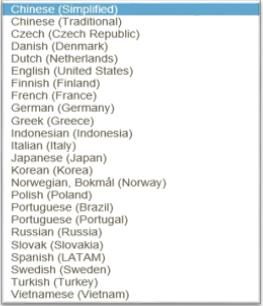

## CIDC Error Report

If a CIDC fails validation, a CIDC error report can be downloaded outlining all of the errors that failed validation efforts. Click the arrow in the status column next to the text “Validation Failed” and select “Download Error Report”.

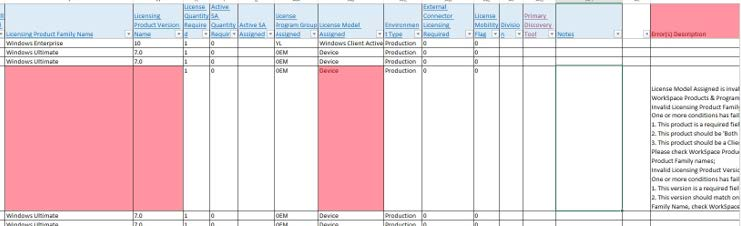

Error reporting is added directly to the CIDC report that was uploaded. All cells that have a validation issue will be highlighted in Red. An additional column is added to each sheet within the CIDC outlining the error(s) for the given row. User can make edits directly to the CIDC error report and upload to IAM. (Note: the CIDC report will still need to have the Engagement level password removed from the file before it can be uploaded and restored/encrypted)

## Edit CIDC Web Form

A “web form” for editing of CIDCs has been developed for Step 2 of Intelligent Asset Manager. This feature is intended to allow users to quickly edit a subset of fields in their CIDC (License Product Family & License Models) without needing to go through the full process of CIDC download, unencrypt, edit, re-encrypt, and re-upload.  
After a CIDC has been uploaded and either an EDP has been generated or is in “CIDC Incomplete” status it can be edited through the web form.

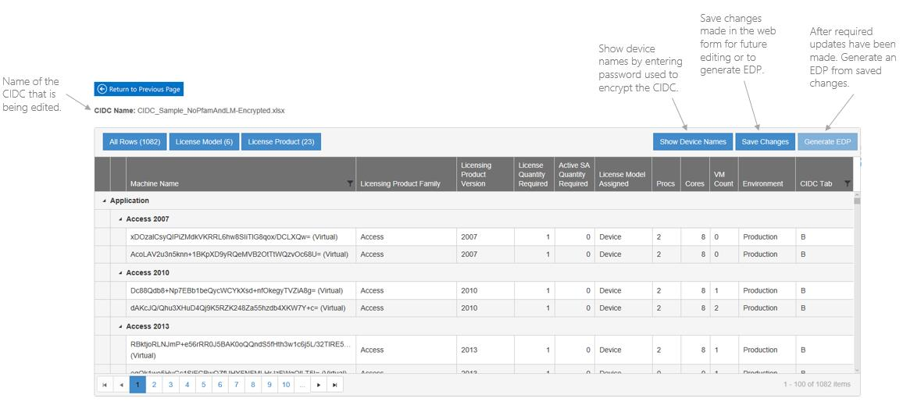

The Edit CIDC table is grouped by the Product Pool (EDP Allocation Type – Sheet 2 of the Product and Program Definitions spreadsheet) and Inventory Product Family and Version listed in the CIDC.

- **Machine Name** – Is the Physical Machine Fully Qualified Name if Machine Type Virtualization is Host or Physical. If virtual the Virtual Machine Fully Qualified name is shown. For records in Tab C the Target machine Fully Qualified Name is shown.
- **Licensing Product Family** – Licensing Product Family Name
- **Licensing Product Version** – Licensing Product Version Name
- **License Quantity Required**- License Quantity Required
- **Active SA Quantity Required** - Active SA Quantity Required
- **License Model Assigned** - License Model Assigned
- **Procs** - Physical Processor Total Count
- **Cores** - Physical Cores Total Count
- **VM Count** - Virtual Processor Count Total
- **Environment** - Environment Type
- **CIDC Tab** – Indicates the tab in the CIDC where the specific record appears. Note that an asterisk (*) in the CIDC Tab column indicates no matching hardware exists on Tab A of the CIDC. This record will not appear in the EDP unless the machine information is added to tab A of the CIDC.

## SQL Core vs. Processor License reporting in the CIDC

Standard, Core, and Processor licenses are captured under separate SAM Product Family Names within Intelligent Asset Manager. To specify core or processor, the appropriate product family must be chosen when manually completing the CIDC. A full list of all available product families and mapping to the accepted License Models can be found on Sheet name “2” of Intelligent Asset Manager_*DomainData.xlsx* which can be downloaded from the *“Product & Program Definitions”* link on the footer of Intelligent Asset Manager.

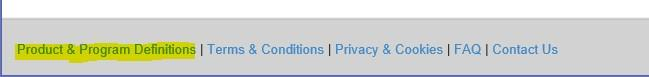
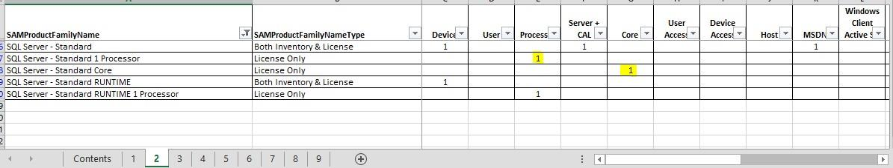

## CIDC Tab G cross checking

The information captured in this tab is populated at the discretion of the individual completing the CIDC form. It is not being cross checked against the data provided in tabs A-F of the CIDC for validation. However, if the fields are left blank a warning will appear in the generated EDP notifying the user that they should consider populating the tab for CIDC completeness.

## Creating and Downloading an EDP

For successful uploads of a CIDC, an EDP report will be generated. To download the newly generated EDP report, the user selects the dropdown arrow on the CIDC file, selects the language that they would like to download the report in, and clicks “Download” to download the EDP report.

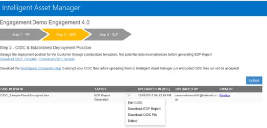
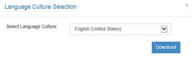

The EDP report summarizes the information contained within the CIDC report into a set of tabs geared towards Customer conversation.  
When opening the file (or any file downloaded from Intelligent Asset Manager) you will need to provide the “File Protection Password” before opening the Excel report. This password was set by the user who first uploaded a CIDC to the Engagement.

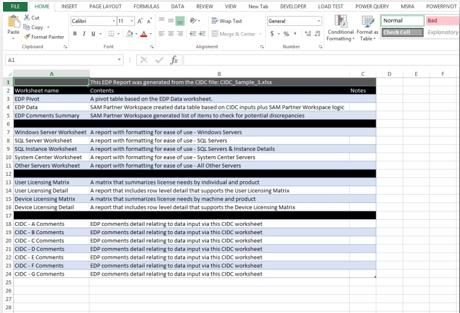

>[!IMPORTANT]
>As a SAM Partner, you should be familiarized and follow the Microsoft guidelines of the [Best Practices for a Quality Inventory](../UI/quality.md), as well as the[ Minimum EDP Quality standard](../UI/quality.md).  

## Finalizing your EDP

>[!IMPORTANT]
> If the Engagement will use [**the free Microsoft’s Centralized ELP Service program](ELPS.md), click on the ELPS link to follow the instructions on how to do so, **do not follow the instructions below to finalize your EDP**.

1. As a first step to finalize an EDP, it is recommended Partner and Customer review and sign off teh data available on the EDP document provided.
1. Click on the “Finalize” link for the EDP you would like to finalize.

   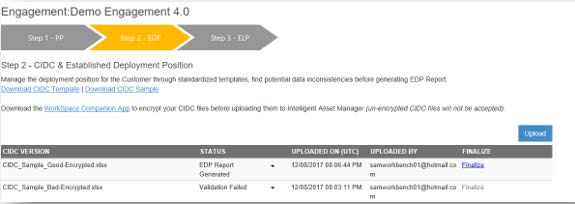

1. There are two selection options provided when finalizing an EDP:
   1. If you are going to be completing an ELP for an Engagement the radio button should be updated to “Yes” to indicate that the EDP is not the last step for this Engagement.
   1. If the EDP is the last step for this Engagement the selection can stay with the defaulted “No” radio button selection.
      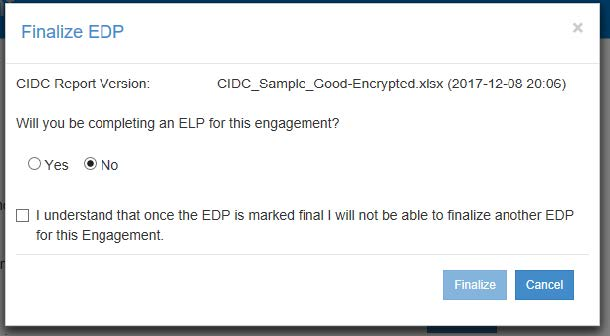
1. Select the appropriate radio button and check the “I understand…” box to finalize the EDP.
1. Then click the finalize button, which will close the Finalize EDP pop up.
1. The step 2 page will go into a “Read-Only” state, and the EDP that was selected for finalizing will be marked as “Finalized”.

   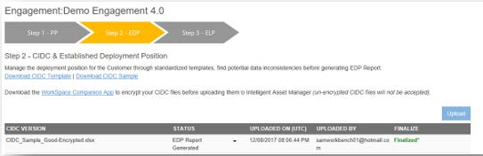

1. The Engagement status will be updated accordingly. If “No” was selected, the Engagement status will read “EDP Finalized”. If yes was selected the status should read “Step 3: ELP” in the Engagement dashboard.

>[!NOTE]
> Even if the EDP is finalized, the user can still upload/edit ELPs for this Engagement if it is decided later that the Engagement will require an ELP.

If it was decided the SAM Engagement will contain the deliverable of an ELP, follow the [ELP Tutorial](ELP.md) section for the detailed procedure.

## Next Step: Effective Licensing Position (ELP)

If your SAM Engagement does not include an Effective Licensing Position (ELP) as a main deliverable, your SAM Engagement finalizes here. However, if an ELP needs to be produced, please read the Tutorial [Effective Licensing Position](ELP.md) (ELP).