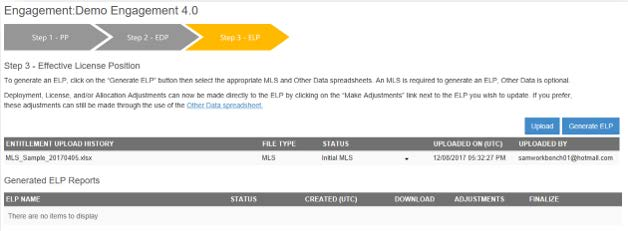
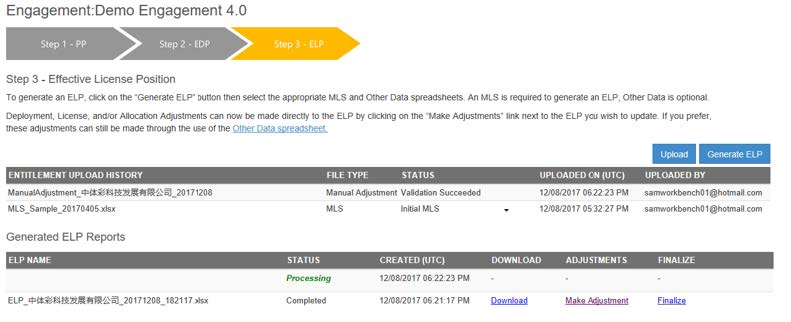

# Tutorial: Effective Licensing Position (ELP)

After [generating the EDP file](EDP.md) for the SAM Engagement, if the Customer chose to receive an ELP through the SAM Engagement, you will need to follow the procedure contained in this section. The chevrons below outline the steps to generate an ELP report and make up the Step 3 process.

- **MLS**: This is the Microsoft Volume Licenses Entitlement position of the Customer. It is provided by the local SAM Engagement Manager.
- [**Other Data Template**](ODT.md): IAM Template that the Partner fills out containing FPP/OEM/ISV/MPSA/others License Entitlement of the Customer (access the section “Templates and Reports” on the IAM Cloud Home screen to download the template and the How-to-use guide)

## Uploading Licensing Data (MLS) into IAM Cloud

1. Click on Manage Engagements tile

   

1. Find the Engagement that you would like to work on and select “Manage Engagement” from the dropdown.

   

1. If an Established Deployment Position (EDP) has already been generated for this Engagement click on Step 3: Effective License Position. Otherwise navigate to Step 2 to generate an EDP.

   

1. Once an EDP has been generated and considered final the next step to creating an ELP will be uploading entitlement information (MLS/Other Data Template) to the Engagement under the Step 3 section.

    

 >[!NOTE]
> The Microsoft License Statement (MLS) provides customers with a detailed account of their Microsoft Volume License Agreements and the product licenses and Software Assurance (SA) benefits acquired under these agreements. However, the MLS is much more than a customer's purchase history. The MLS also provides a License Summary – the output of an analysis that shows the application of upgrades and SA to underlying full licenses to calculate the net license position for each Microsoft product name edition, and version. The ELP uses the MLS to map software deployments to license entitlements. IAM will not generate an ELP without a current MLS.

   

5. MLS information can be uploaded by clicking on the *Upload* button and navigating to the MLS you would like to upload.
1. Additional licensing information not captured in the MLS (FPP, ISV, MPSA) can be provided by using the “Other Data” Template spreadsheet. Click on the Upload button and select the “Other Data” radio button to upload this additional entitlement information. Instructions for use and completion are below.
  
   

1. Uploading an MLS and/or Other data will not trigger an ELP to be generated automatically.

   The Effective License Position (ELP) is specific to SAM engagements and provides details related to license entitlements and deployments. It is an output from the EDP generated by IAM Cloud.

   

   The ELP provides three high-level summaries of the Microsoft software deployment data mapped to license entitlement information (Classic, Program and Flat). Depending upon the customer scenario or situation, one view may be more desirable for use by the SAM Partner during customer discussions. Within each of these worksheets, the colored columns may be expanded to find details on how the deployments are mapped to the various licensing programs and rights.
  
   >[!NOTE]
    > The MLS Volume Licenses column within the ELP - Program View will not be automatically populated in the top table of this view as the MLS does not split out effective license quantity by license program.

   ELP Summary tab information is pulled from the Pre-engagement Customer Survey, Tab G of the CIDC, and account information from CRM. Fields that are not automatically populated are optional.

1. Once the appropriate files have been uploaded, you will need to choose one of the two options below for generating the ELP:
   - [Microsoft’s Centralized ELP Service](ELPS.md) – **Recommended: Centralized Microsoft Business Desk that performs the highly specialized, complex and rapidly changing product-to-licensing logic reconciliation processing activities required to ensure accurate SAM Engagements that require an ELP. This is a free-of-charge service and the ELP provided through this service is a Microsoft-validated Licensing Position of the Customer IT environment, other ELPs that do not go through this service is not Microsoft validated,since they are generated by the SAM Partner through the option below.**
   - Create your own ELP (see further below the instructions)

## Best practices for validating Customer’s Licensing information**  
One of the most important requirements for generating a high-quality ELP for your SAM Engagement,which will support you in delivering value to your Customer,is ensuring the accuracy of the Licensing information you submit via MLS and Other Data Template.  
Please find below some best practices recommendations on how to check the accuracy of your data:

- **MLS**: Work with your SAM EM to ensure:
  - All Customer Account Names used in past Contracts are captured
  - Licensing information is related only to the Country in which the Engagement is taking place
  - In the License Summary tab, verify if “Active SA Quantity” is higher than “Effective License Quantity” or if there is a large amount of SA which is marked as “Unresolved (not used)”
- **Other Data Template**:
  - Include all FPP, OEM and MPSA licenses
  - Other VLSC that could not be included in MLS – ***For the Centralized ELP Service**, in this case you will need email agreement from your SAM EM to include those in the ODT*
  - If there are MPSA licenses, please verify the SA coverage period dates

>[!TIP]
> There are certain license types that are not captured within the MLS. To capture these types of licenses (OEM, FPP, etc.) the [Other Data](ODT.md) spreadsheet can be used to modify the ELP.  

>[!NOTE]
> If you realize there are missing deployment data on your ELP, it cannot be added using the [Other Data](ODT.md), it should be scanned by the initial data sources and UI should be used to include it into the CIDC. CIDC should be re-uploaded into the IAM Cloud engagement and then it will be possible to see the additional deployment data on the EDP. 

## Create your own ELP

In case the Partner chooses to generate the ELP themselves, please follow the steps below on the “Step 3” button of the chevron.

1. Click on the *Generate ELP* button.
  
   

1. Select from the drop downs the *MLS* and *Manual Adj / Other Data* spreadsheet you would like to use to generate your ELP.

   

1. You must have an MLS to generate an ELP, the Other Data and manual adjustments is an optional field.
1. Click Generate ELP to start the creation of your ELP.

## System Generated License Allocations (SGLA)

There are two types license allocation rules applied automatically by IAM when generating an ELP.

- **Downgrade Rights** - Excess license quantities from the MLS and/or Other Data are applied to earlier versions of the same product. Version rankings can be found on Tab 3 of the Product & Program Definitions Sheet.
- **Cross Edition Rights** – A subset of product families (Windows Server, SQL Server) have been grouped together to apply excess licenses from one edition to another (Enterprise covering Standard). These product groupings can be found in tab 3 of the Product & Program Definitions Sheet.

There are two places where SGLA can be removed from the calculation of your ELP:

- **Generate ELP Pop-up screen**

  

- **Manual Adjustments Page**

   

Note: Once SGLA is removed it cannot be added back in on this screen. You can click on the “Return to Previous Page” to undo changes made on this page.

## Manually Adjusting ELP

Adjusting your ELP can now be made directly in Intelligent Asset Manager without using the Other Data spreadsheet. You can use the web form to edit Entitlement, Deployment, & License Allocation adjustments. After your ELP has been generated click on the “Make Adjustments” link next to the ELP you would like to edit.

This will take you to a new screen populated with a summary of your ELP grouped by “Product Pool.”

The following adjustments can be made on this screen:

- **Total Software Entitlements**: in the Other Data spreadsheet, this was known as a Manual Adjustment. Adjustments made here will be offset using the “Manual MLS Adjustments” column within the ELP.
- **Manual Allocation Adjustments**: in the Other Data spreadsheet, this was known as a Licensing Allocation Adjustment. Adjustments made here will be offset using the “Manual License Allocation Adjustments” column within the ELP.
- **Notes**: Notes can be recorded using this field and will be recorded in the ELP “Notes” column.

>[!NOTE] 
> All adjustments can still be made using the [Other Data](ODT.md)spreadsheet. 

## ELP Editing Example

Once you have completed all your adjustments, click on the “Generate Adjusted ELP” to create a new ELP with your manual edits. You will be sent back to the Step 3 page where your new ELP will be generating at the top of the “Generated ELP Reports” grid.

Users can re-apply updates they have made using the Manual Adjustment functionality to ELPs generated in the future. This is useful if an ELP needs to be generated with a newer version of the MLS and you have already made the changes to an existing ELP. Instead of needing to make all your manual adjustments again, you can simply upload the new MLS and select a past Manual Adjustment to apply to the creation of a new ELP. If a manual adjustment is available to be used it will appear in the Entitlement Upload History
grid. Selecting a previous Manual adjustment will apply both the manual adjustments made and any Other data spreadsheet used in the original creation of the ELP.

## Downloading and ELP

To download a copy of your ELP, click on the ‘Download” link next to the ELP you wish to download.

## Finalizing ELP

Once you have completed your ELP and you are ready to finalize, click on the “Finalize” link next to the ELP you would like to finalize. Once that is turned into green “Finalized”, you are done with your IAM Engagement.

