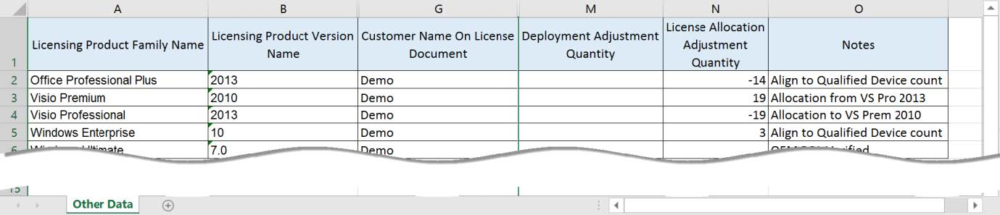
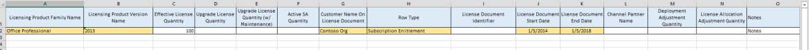
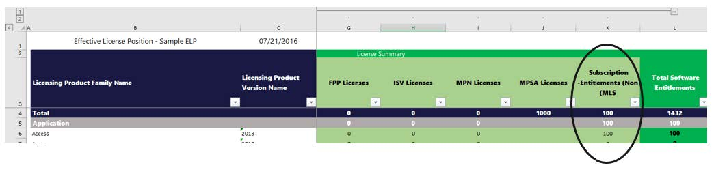

# Using the Other Data Template

## What is the “Other Data” Spreadsheet

The Other Data spreadsheet is a spreadsheet used during the creation of an Effective License Position (ELP) within Intelligent Asset Manager. It can be used to add new licenses (OEM, FPP, ISV, MPN, MPSA, and Subscription Entitlements) not captured within the Microsoft License Statement (MLS) or used to manage manual adjustments to the ELP (Manual MLS Adjustments, Deployment
Adjustments, and Licensing Allocation Adjustments). ELPs are generated only after a Microsoft License Statement (MLS) has been uploaded to the engagement. After the MLS has been uploaded the “Other Data is used by IAM.

# What are the types of adjustments handled within the “Other Data” Spreadsheet?

| Row Type                        | Use                                                                                                                                                                                       | ELP Adjustment Column                 |
|---------------------------------|-------------------------------------------------------------------------------------------------------------------------------------------------------------------------------------------|---------------------------------------|
| OEM                             | Used to add OEM licenses to the ELP calculation. OEM licenses do no get captured within the MLS.                                                                                          | OEM Licenses                          |
| FPP                             | Used to add FPP licenses that are not captured within the MLS                                                                                                                             | FPP Licenses                          |
| ISV                             | Used to add ISV to licenses to the ELP.                                                                                                                                                   | ISV Licenses                          |
| MPN                             | Used to add MPN specific licensing that is not captured within the MLS                                                                                                                    | MPN Licenses                          |
| MPSA                            | Used to add MPSA licenses to the ELP.                                                                                                                                                     | MPSA Licenses                         |
| Subscription Entitlement        | Used to add subscription entitlements that are missing from the MLS.                                                                                                                      | Subscription Entitlements (Non-MLS)   |
| Manual Adjustment               | Manual Adjustments that need to be made to the licensing quantities within the MLS.                                                                                                       | Manual MLS Adjustments                |
| Deployment Adjustment           | Manual adjustment to incorrect deployment quantities. This could be a result of incorrect EDP datasets after finalizing. The note field is required if a deployment adjustment is made. | Manual Deployment Adjustments         |
| Licensing Allocation Adjustment | Manual Adjustment to the Licensing allocation quantities being calculated in the ELP.                                                                                                     | Manual License Allocation Adjustments |

***Where is the “Other Data” Spreadsheet available for download?***

There are two places on Intelligent Asset Manager site where users can download the Other Data spreadsheet. Under the “Manage Other Data” tab within step 3 or “IAM User Guide & Templates” on the landing page. In both places users can download a sample file that will pass validation or download a template file which defines the data type requirements and validation criteria for each
column within the spreadsheet.

![Download Other Data Spreadsheet Location]************(media/Download_Other_Data_Spreadsheet_Location.jpg)

*Example –*  
The customer purchased a subscription to Office directly from Microsoft and the licenses are not being captured in the MLS generated for the customer.

1. Download “Other Data” sample file from Intelligent Asset Manager for latest Other Data column set.
1. Add required information to the “Other Data” spreadsheet.

   - ***Licensing Product Family Name*** – Accepted values can be found in Sheet 3 Product & Program Definitions Sheet (Domain Data)
   - ***Licensing Product Version Name*** – Accepted values can be found in Sheet 3 Product & Program Definitions Sheet (Domain Data)
   - ***Customer Name on License Document*** – Name of the customer, must be less than 255 characters.
   - ***Row Type*** – One of the following OEM, FPP, ISV, MPN, MPSA, Subscription Entitlement
   - ***License Document Start Date*** – date time field of the license start. For OEM, FPP purchases can mark this as 1/1/1900
   - ***License Document End Date*** – date time field of the license start. For OEM, FPP purchases can mark this as 1/1/1900.

1. Add appropriate “Effective License Quantity” for the licenses purchased by the customer.

   

1. Navigate to the “Manage Other Data” tab under Step 3 of the engagement.
1. Click the upload button and select the “Other Data” spreadsheet.
1. ELP is generated – entitlements uploaded are reflected in the “Subscription Entitlements (Non-MLS)” column of the ELP for this specific row type. If Row Type = “OEM” licenses would be shown under the “OEM Licenses” column.

    

