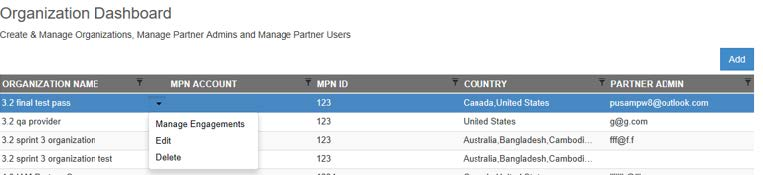
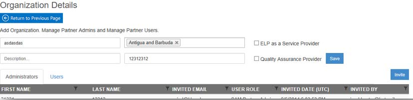
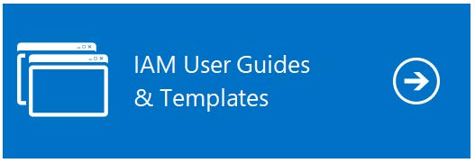
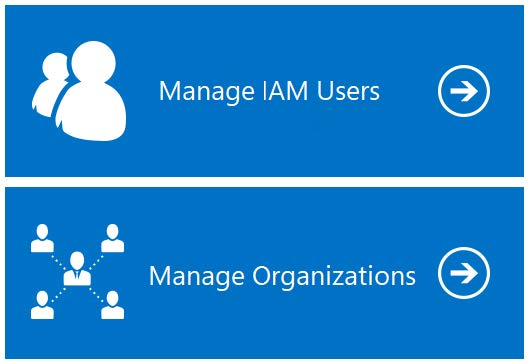
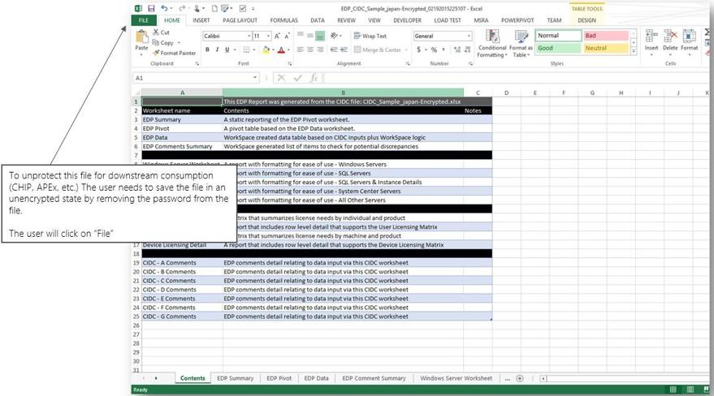
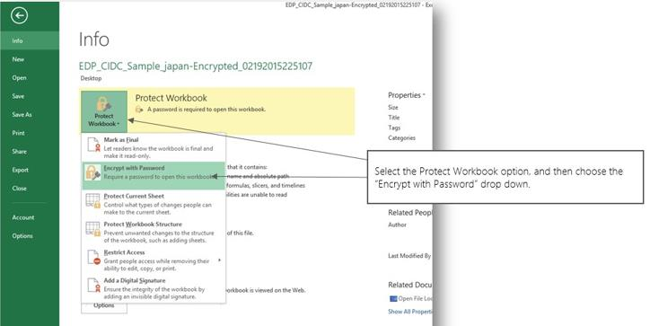
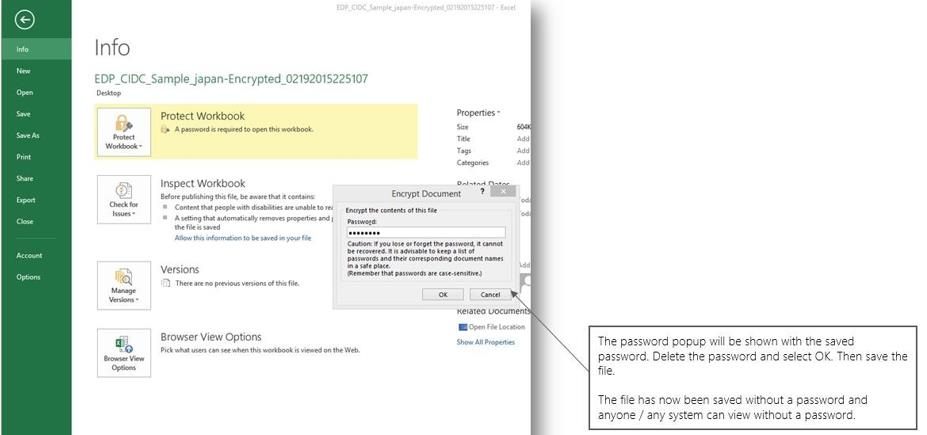
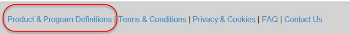
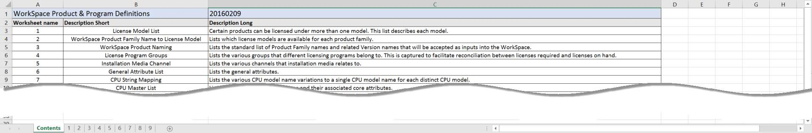

# Tutorial: IAM Cloud Administrative work for SAM Partners

## IAM Cloud Requirements

- Microsoft Excel 2007 or higher
- Connection to the internet
- Have a Microsoft Account with access to Intelligent Asset Manager

## User Types and Provisioning

There are currently 2 different types of users with elevated Admin permissions to IAM platform:

- **Geo Admin***: Responsible for creating Partner Organizations and inviting SAM Engagement Managers located in their Subsidiary/Country. They can also complete the Engagement workflow if no Partner is involved in the Engagement.
- **SAM Engagement Manager***: Microsoft resource responsible for creating Partner Organizations and assigning new Engagements to Partner Organizations. They can also complete the Engagement workflow if no Partner is involved in the Engagement.

There are currently 2 different types of users within a Partner Organization on IAM Platform:

- **SAM Partner Admins***: Responsible for managing (add/delete) SAM Partner Users, assign users to the Engagements and manage Engagements within their Partner Organization. Specific to SAM roles and responsibilities but can complete any type of Engagement assigned to the Partner Organization.
- **SAM Partner Users**: Assigned by the Partner Admin, can manage Engagements within their Partner Organization and complete IAM workflow tasks. Specific to SAM roles and responsibilities but can complete any type of Engagement assigned to the Partner Organization.

To get provisioned for any of the User Types above marked with an “*” please reach out to IAMSupport@microsoft.com or, if you are a Partner, you can also contact your local SAM Engagement Manager.

>[!NOTE]
> You will need either a Microsoft Account (formerly Live ID) or a Microsoft Work or School Account to log in.

## Adding SAM Partner Admins/Users

1. Click on the ‘Manage Partner Organizations’ tile in the home page, Partner Organization Dashboard is shown to the user

   

1. Click on ‘Edit’ menu item next to the Partner Organization name to Invite Partner Admins/Partner Users.

   

1. On click of the ‘Edit’ menu item the Partner Organization Details page is shown to the user.

    

1. Click on the ‘Invite’ button to Invite SAM Partner Users to your organization.
1. An email invitation will be sent to the users allowing them to access IAM.

## Organizing your IAM Engagement Dashboard to make active active engagements more visible

Users can “Pin” their most viewed engagements to the Engagement Dashboard. Simply click the pin icon (  ) to the left of the engagement and refresh the page to bring the pinned engagement the top of the engagement table. Pinned engagements will always appear first on your list of engagements. If you no longer wish to keep the engagement(s) at the top of the engagement table, “unpin” the engagement by clicking on the pinned icon (  ) and refresh the page. The engagement will return to the original placement within the table. Pinning is specific to the individual user’s view of the engagement dashboard.

## Creation of IAM Engagement

IAM Engagements are created by your SAM Engagement Manager (EM). To be created, you will have to provide to your SAM EM the following:

- Customer Name
- Copy of signed Letter of Engagement
- Connect ID (Partner Lead)

## Additional Guidance and Sample Reports

Additional IAM guidance and sample reports can be found under IAM User Guides & Templates tile of Intelligent Asset Manager.

IAM Admin users and Partner users are managed through the tiles shown below.  
(Depending on your level of permissions you may not see these tiles)

## Engagement Level Password Protection

Engagement level “File Protection Password” is an optional functionality that can be set by the user and specific to an Engagement. The password can be set in the Engagement Dashboard for each Engagement, which will be used to protect all file downloads from that Engagement.  
The password cannot be changed once it is set for the Engagement.  
If the user chooses to set a “File Protection Password” then all files being downloaded from that Engagement are being password protected with a password that is set up by the user and specific to an Engagement.The file protection is an additional level of security placed on top of the encryption of all PII fields within the CIDC, EDP, and ELP.

## How To: Remove Password Protection from Downloaded Report

Before any downstream system can consume files from Intelligent Asset Manager (CHIP, and IAM Encryption/Decryption tool) the password protection must be removed from the file. The steps below outline this process within Excel.

## How to: Adjust deployment quantities reflected in the ELP

In certain scenarios, manual adjustments need to be made to license allocations made by the system or incorrect deployments quantities pulled from the finalized EDP. In these cases, there are two types of entries that can be made through the Other Data spreadsheet.  
Example –  
The Established Deployment Position (EDP) was finalized, but a change to the deployment quantities of SQL Server is required.

1. Download “Other Data” sample file from Intelligent Asset Manager for latest Other Data column set.
1. Add required information in the “Other Data” spreadsheet for adjustments.

   - ***Licensing Product Family Name*** – Accepted values can be found in Sheet 3 Product & Program Definitions Sheet (Domain Data)
   - ***Licensing Product Version Name*** – Accepted values can be found in Sheet 3 Product & Program Definitions Sheet (Domain Data)
   - ***Row Type*** – One of the following Manual Adjustment, or Licensing Allocation Adjustment. 
   - ***Notes** – Notes detailing why the adjustment was needed*.

1. Navigate to the “Manage Other Data” tab under Step 3 of the engagement.
1. Click the upload button and select the “Other Data” spreadsheet.
1. ELP is generated 

## Additional Information

### **Product & Program Definitions**

The Product and Program Definitions spreadsheet referenced below, contains the standard product taxonomy for the main IAM site. It is updated on a weekly basis as product definitions are updated (newly released products/versions, new processors identified, etc.) This Excel spreadsheet can be found in the footer link of Intelligent Asset Manager. This report is necessary for the completion of the CIDC and Other Data Template as it contains details on the taxonomy (i.e., naming conventions) used within Intelligent Asset Manager site, such as License Product Family Names or License Product Family Version Names. If this information is entered incorrectly in either report, then the reports may fail when uploaded to Intelligent Asset Manager site.

Located in the footer link of [Intelligent Asset Manager](https://www.intelligentassetmanager.com/):

### **SAM Product Family Name Types**

There are three different types of product family/version combinations within Intelligent Asset Manager (outlined below). The type is meant to identify what “type” of product family name/version is listed. There are certain product family names that can ONLY be used in the data collected as inventory and others that can ONLY be used for licensing. Within the CIDC, both the inventoried name and license product name (which needs to be filled in manually by the user creating the CIDC) is captured. Some product family names and
versions may be used in both columns. The mapping between Product Family Name and Type can be found within sheets 2 and 3 of the IAM_DomainData.xlsx which can be downloaded from the “Product & Program Definitions” link.

| SAM Product Family Name Type | Use Case                                                                                                                                                                            |
|------------------------------|-------------------------------------------------------------------------------------------------------------------------------------------------------------------------------------|
| Both Inventory & License     | Identifies that this Product Family/Version can be used in both the Inventory Product Family/Version columns AND the Licensing Product Family Name/Version columns within the CIDC. |
| License Only                 | Identifies that this Product Family/Version can only be used in the Licensing Product Family Name/Version columns within the CIDC.                                                  |
| Inventory Only               | Identifies that this Product Family/Version can only be used in the Inventory Product Family/Version columns within the CIDC.                                                       |