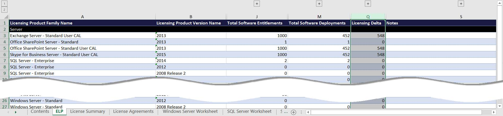
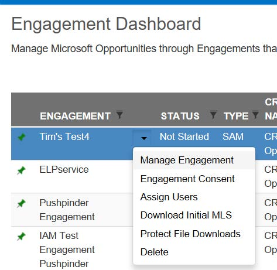
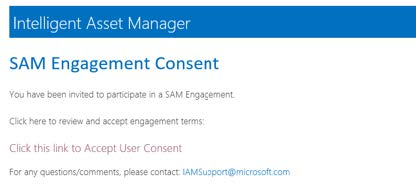
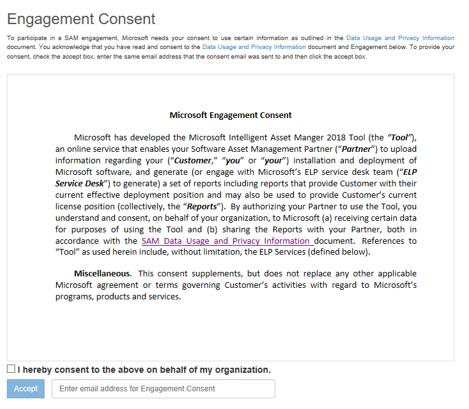

# Tutorial: Preparation to use IAM Cloud for SAM Partners

Once a Clean Inventory Data Contract (CIDC) file has been generated and encrypted using the [Universal Inventory](../../Overview/UI.md) application, this file can be used to generate an Established Deployment Position (EDP) report and, if required by the SAM Engagement, an Effective Licensing Position (ELP) report through the [**IAM Cloud**](https://www.intelligentassetmanager.com/) platform.

**The EDP** is a customer-ready Excel report automatically generated by the IAM Cloud online site and is the output of the CIDC. It represents the complete picture of the customer’s Microsoft product and technology deployments. This report is a more customer-friendly view of the data gathered in the CIDC.

Data such as machine name, user name and IP address is important to collect to provide a customer with a complete engagement and detailed, customer-specific recommendations. The collection and analysis of this data by the SAM Partner is critical to providing the customer with a value-based engagement.

**The ELP** report will match the information presented at the final EDP report against the Microsoft Licenses Entitlement from the Customer running the SAM Engagement. It helps identify potential risks for Microsoft non-compliant Licensing ("Licensing Delta shown on the picture below). Although recommended, it is currently not anymore required for a Microsoft SAM Engagement ran by a Microsoft SAM Partner.

The Tutorial section for the SAM Partners will showcase how to get access to IAM Cloud platform, how to tackle the IAM Cloud administrative work required, as well as end-to-end steps on how to upload the UI CIDC file into the tool and generate both EDP and ELP reports.

>[!TIP]
> Additionally, to the steps described on this Tutorial, you can watch the video of the [IAM 2018 Session 4: End-to-End Engagement using the IAM Platform](https://aka.ms/iamsession4).

>[!IMPORTANT]
> For any Microsoft SAM Engagement be able to be submitted at the IAM Cloud platform, the SAM Partner will have to do the procedure below to get the Customer's Consent on the SAM Engagement, which basically consists of an online signing from the customer to consent to the IAM Data Usage and Privacy terms.

## Customer’s Engagement Consent

All new Engagements require an Engagement Consent form to be signed by the person at the Customer who has <ins>authority to authorize a SAM Engagement</ins> ‘contact’. IAM Cloud will not accept a CIDC until this consent has been received. Microsoft requires written consent directly from the customer before any decrypted Personal Identifiable Information (PII) is accepted. The SAM Engagement Manager will work with SAM Partner and the customer to ensure all Microsoft policies and procedures are met for sharing and sending PII.

To send an Engagement consent via email to this contact, sign into [IAM Cloud](https://www.intelligentassetmanager.com/), select the “Engagement Consent” option in the caret dropdown for the Engagement.

Partner should select the correct “Engagement type” for this Engagement:

- "ELP as a Service” to be used only if an ELP will be created using [Microsoft’s Centralized ELP Service program](ELPS.md).
- "Partner Led” Engagement type: For all others

To choose the right Engagement type, click on “Edit” right next to the Engagement Type option, and select the preferred option. If you choose “ELP as a Service”, select on the first drop-down menu the option "SAM Live!" for ELP Service Provider, you do not need to choose any option for the "Quality assurance provider".

Next, enter the email address for the contact and click the “Send” button.

The contact will receive an email from iamc@microsoft.com with a link to consent to the Engagement activities.

The contact should then click on the link, which present the appropriate terms for the Engagement.

The contact will need to enter the email address used to receive the Engagement consent, check the acceptance language, and then click on the accept button.  
Partners and SAM EMs can review when and by whom consent was accepted by looking under “Acceptance Detail” on the “Engagement Consent” screen in the IAM Cloud  
After the consent has been received by the contact, IAM Steps 2 and 3 will be enabled for this Engagement.

If needed due to changes in roles, etc at the Customer, or due to choosing for the Centralized ELP Service later on the process, consent forms can be resent to alternative contacts or again to the same contact.