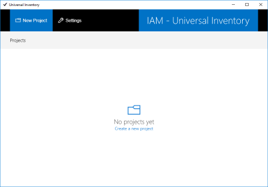
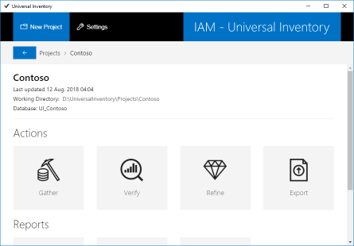

# Create an inventory

After Universal Inventory is [installed](installation.md), follow these steps to create an inventory of the infrastructure:

## Create a Project

Use the **IAM-UI** shortcut on the desktop to open the Universal Inventory client application. *No projects yet* will be displayed the first time the application is launched.

Many projects can be created in Universal Inventory. Every Project corresponds with an *inventory*, and can have many *data sources*. An organization with a complex infrastructure may consider creating a test project to validate correctness and verify data source availability, before creating a production project to be shared with value providers. SAM Consultants may create a project for each customer, provided customers consent to their data being stored on the consultant's machine.  

First you must create a project.

- Click **New Project** in the top-left corner of the screen and enter a name for the project. A valid project name consists of alphanumeric characters and spaces only, and is between 3 and 64 characters long.

- Click **Save**. An inventory database is created on the database server and a *project card* displays the status of the project and last update time.  

   

- Click **Open Project** in the project card. The project board displays available actions and reports.  
  
  

## Gather

There are two ways to gather data into your inventory:

- Use connectors available through UI
- Use connectors available from 3rd party providers

The quality of your inventory depends largely on the completeness of the data it contains. Consider as much sources of data to come to a complete inventory. Organizations running Windows domains may want to combine data from Active Directory with data from their virtualization system, an IAM-certified discovery tool, and any cloud subscriptions.

This next section explains how to set up a connector available through UI:

- Click **Gather** in the project board. *Data source not found* will be displayed the first time the Gather screen is opened for a project.  
  
  

- Click **+ Add** in the top right corner of the screen. A list of connectors available in UI appears to the right.  
  
  

- Scroll through the list of available connectors and click **Add** on the appropriate connector. Depending on the type of connector selected, an **Add data source** dialog will show up allowing you to enter the parameters required to connect to the data source.  
  
  E.g. selecting the MAP Toolkit 9.x connector will bring up the below dialog allowing you to specify a Microsoft Assessment and Planning Toolkit database as source.

  

  Enter the parameters required to select and make a connection to the data source. When connecting to a database server, select the blue Refresh button to reveal a list of databases available on the server and select one.

  The **Tenant/Site** field is optional. At a later stage this field allows you to limit data in reports. E.g. geographically dispersed organizations might specify a site name to be able to only report on data from a specific site. Internet providers might specify a tenant name to be able to only report on data from a specific tenant. Multiple data sources can have the same Tenant/Site value.  

  > [!IMPORTANT]
  > Remember that Universal Inventory runs as Windows service. When you select 'Windows Integrated' authentication, it will not be the current user that connects to the data source to import data, but the [service account](installation.md#service-account) of the Universal Inventory service.

- Click **Add** in the Add data source dialog. The data source configuration is saved and a *data source card* displays the status of the data source and last update time.

- To import data from the data source into the inventory, click the cog wheel on the data source card and select **Run** from the dropdown-menu. The status of the data source will change to *Running*. After the import is completed, the status changes to *Complete*.  

  If the data source status is *Failed* or *Partial*, open the log file to troubleshoot. The log file is in the [Work Folder](installation.md#work-folder) you specified during installation. If the information in the log file does not allow you to solve the issue, turn to [IAM Support](https://www.intelligentassetmanager.com) for help.

## Verify

