# Tutorial: Installing Universal Inventory

Before starting the work to install the Universal Inventory application, make sure you have read the [UI Preparation Tutorial section](preparation.md), which contains detailed information about the Prerequisites for installing UI.

## Quick Tips

- Download the Universal Inventory Application [here](https://aka.ms/downloadUI).
- Always start UISetup.exe **in administrative mode**.
- If a previous installation of Universal Inventory is detected, UISetup allows you to uninstall it.  
- If the version of the previous installation is lower than the version being installed, UISetup allows you to upgrade the existing installation.
- If no previous installation is detected, UISetup displays the **Overview** page to start a first-time installation.
- Click **View Log file** in the top-right corner at all times to bring up a log file that can help in troubleshooting any issues that occur during upgrade or installation.

## Installing Universal Inventory and Encryption/Decryption Tool

> [!TIP]
> If you prefer a video guided training about how to install the Universal Inventory application, you can also watch the [IAM 2018 Session 2: Installing Universal Inventory](https://aka.ms/iamsession2) (this recording still uses the first version and look-and-feel of UI, but the workflow remains correct).

1. To download the Universal Inventory, go to [https://aka.ms/downloadUI](https://aka.ms/downloadUI) and download the “UISetup” compressed folder. Extract the files contained on the folder and run the “UISetup” Application.

   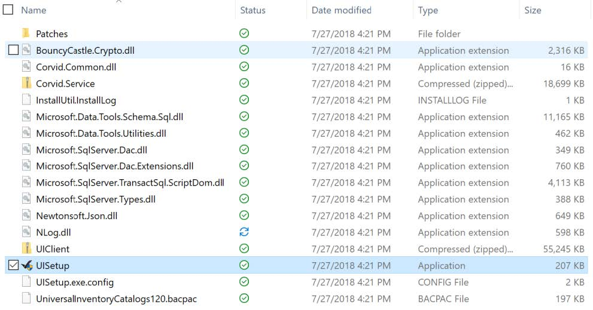

1. Once you finalize the installation of “UISetup”, it will install two different client apps on the computer: (1) Universal Inventory (IAM-UI) and; (2) IAM Encryption/Decryption Tool (IAM-EDT).  
   >[!IMPORTANT]
   > **The installation of UI must be done on Customers domain.**

1. First, run the “UISetup” as an administrator by right-clicking it and choosing “Run as administrator” option, it is the safest way to install UI.
1. The Universal Inventory Setup windows will open and the first thing you will see is a list of the prerequisites needed.

>[!NOTE]
> As previously mentioned on the Prerequisites section,there are two core components for running successfully UI, SQL Server 2014 or later, Express Edition or higher and also SQL Management Studio. If you do not have them installed, follow the steps 5 to 13.

   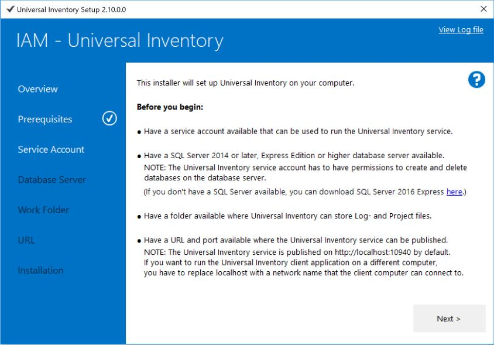

5. For starting SQL Server 2016 Express installation, click on the link available on the UI window (under the second bullet) to download it.
1. For installing SQL Server 2016 Express, run the Application downloaded. Select the installation type (Basic/Custom), then choose the directory for extracted files and an download of the installation files will start.
1. Once it is successfully downloaded and installed, the Remote Desktop Connection window will appear, select the first option “New SQL Server Stand-alone installation”. Accept the application terms and run the installation.

   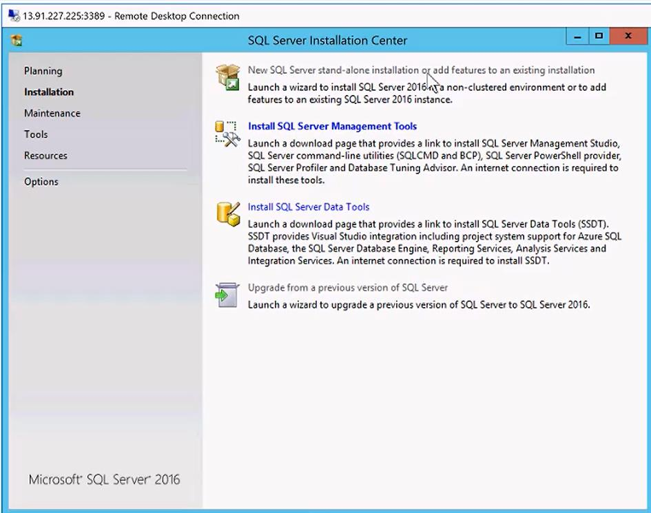

1. When you reach to the “Feature Selection” step, select only the core component “Database Engine Services”. All the other features available are not necessary for the installation of UI.

   

1. On the “Instance Configuration” step, name the “Named Instance” as “Universalnvent” or any other easily-identifiable name, press “Tab” and the “Instance ID” will be automatically populated and then click on Next.

   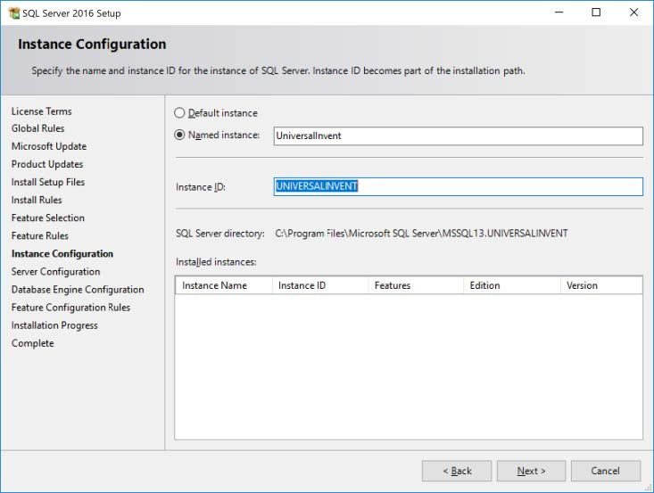

1. On the tab “Server Configuration”, verify your Service Accounts and Passwords, if necessary, and on the “Collation” tab, you should add “SQL_Latin1_General_CP1_CI_AS” as Database Engine to make sure it takes into account characters that are commonly used outside the standard English speaking regions.  
   NOTE: This Collation definition is important also for other Microsoft components such as System Center Configuration Manager and others.
  
   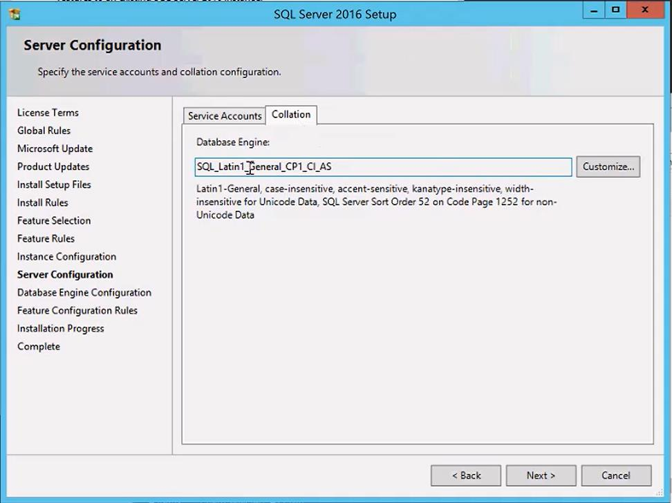

1. On the next tab, “Database Engine Configuration”, select the appropriate Authentication Mode, we recommend the first option “Windows authentication mode”. Review also the SQL Server administrators, if will as default suggest that you use the Windows logged-on user.

     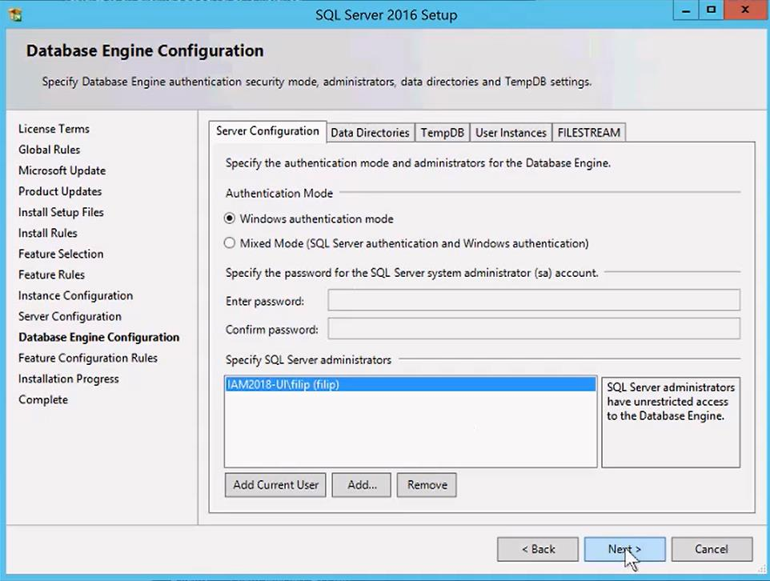

1. Proceed to the next step to get the Installation running and completed. Review if all the features are correctly installed and shown as “green” and close this window. This concludes the SQL Server 2016 installation.

   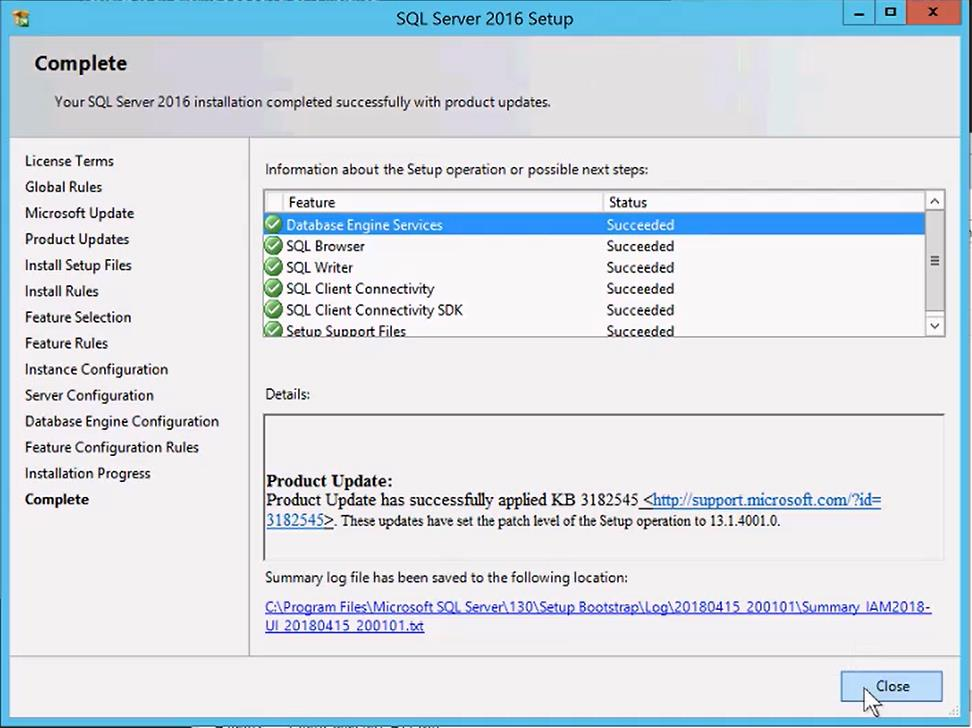

  >[!NOTE]
   > It is recommended independently of the edition/version of the SQL Server you choose to use,provided that it follows the UI pre requisites, that the [SQL Management Studio](https://docs.microsoft.com/en-us/sql/ssms/download-sql-server-management-studio-ssms?view=sql-server-2017) is installed, to be sure you can connect in the right way to the different databases available on the system (since for SQL 2016 and higher you need the most recent Management Studio for loading the core Universal Inventory datasets).

1. After downloading and running SQL Management Studio installer Application, you will see the black window shown below. Click on “Install”. The installation will then run, once it is completed you will be requested to restart the computer to finalize the setup.

   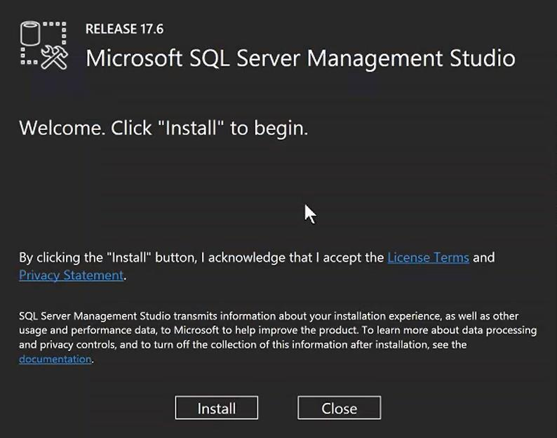

1. Now, going back to the UI installation, open the “UISetup” Application again by right clicking it and choosing “Run as Administrator”. Click on “Next” and you will see a checklist with a validation of the prerequisites. If all of them are green you will be able to proceed to the next page.

   

1. You will then need to provide a user name that can be used for the UI Service Account. 

   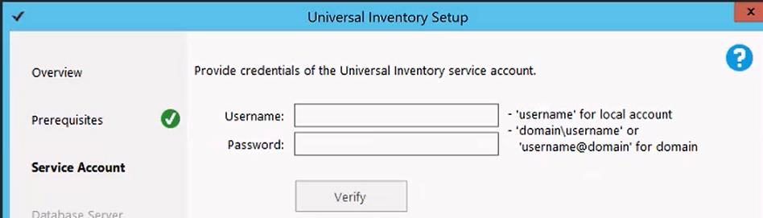

>[!TIP]
>On the **Service Account** page, enter the credentials of the Universal Inventory Service Account. For a local user account, enter the user name only. For a domain account, enter the logon name in the format `domain\username` or `username@domain`  

1. To create a Service Account through the local user’s database open “Computer Management” panel under your Windows search bar. Open the drop-down menu on the left for the “Local Users and Groups” and select “Users” folder. You should then right click on the blank space and select “New User”.

   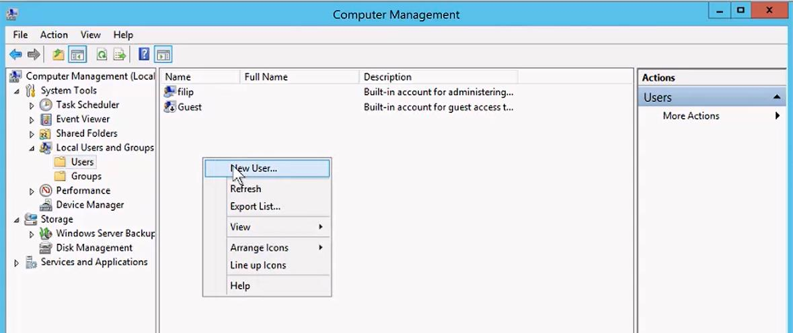

1. You will then be prompted to fill out information about the Service Account. Note that password must follow the organization’s password policy. Also, select the options “User cannot change password” and “Password never expires”, to avoid future issues with the Service Account. Click on “create” when done.

   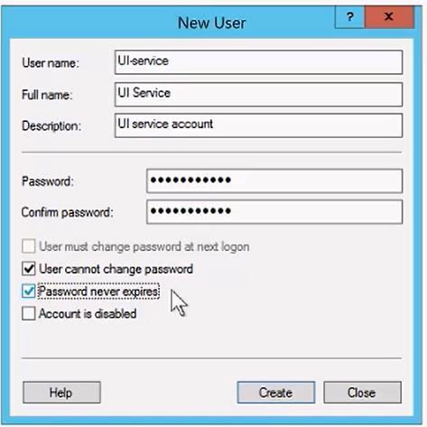

1. You should know that it was created successfully once you see the user on the user list, such as below.

   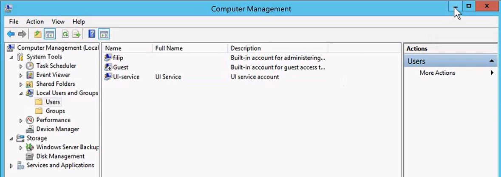

1. Now going back to the UI interface, populated the Service Account username and password and click on “Verify” to check that the service account can logon using the specified credentials, and to grant it the *Logon as a Service* permission.. The pop-up window should confirm that the Service Account has been granted the Logon as a service permission.

   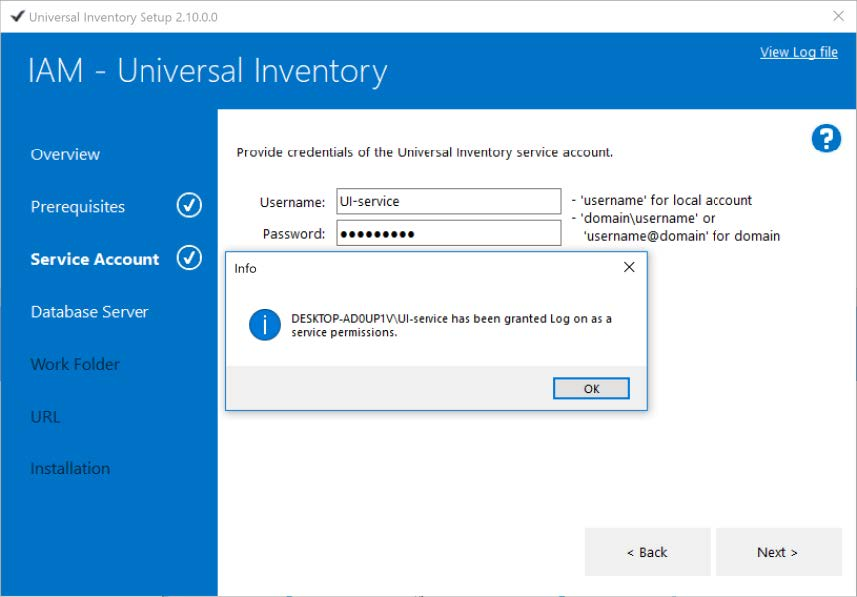

1. Before moving to the next stage of UI installation, you need to configure your Service Account as a system administrator for it to be able to logon to the database server. To do so, you will need to use the SQL Management Studio previously installed. When you open the application, in most cases it will automatically verify the Server Name you created for UI, in this case named “UniversalInvent”. If not, select the correct server name and click on “Connect".

   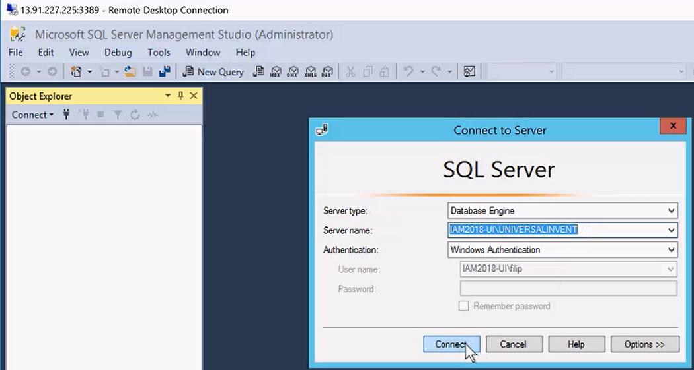

1. You will then see a menu on the left hand-side, open the “+” sign on “Security”. Right click on “Login” right below it and click on “New Login”

   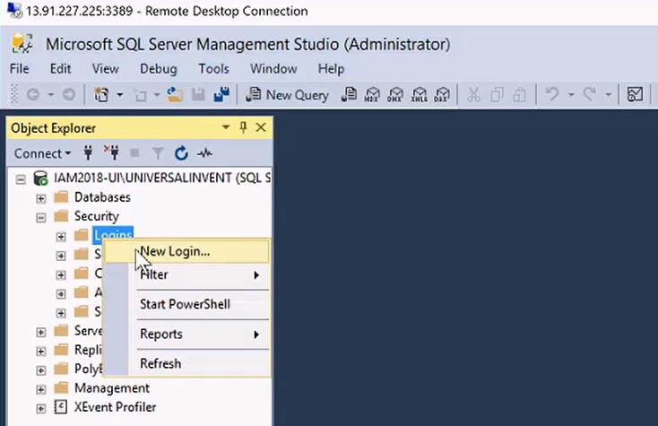

1. Type in the Service Account name (in this case, “UI-Service”) and click on “Search”.

   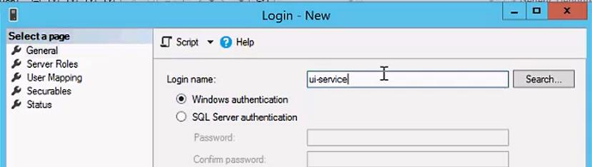

1. Re-type the Service Account name on the box and click on “Check Name” and then on “OK”.

   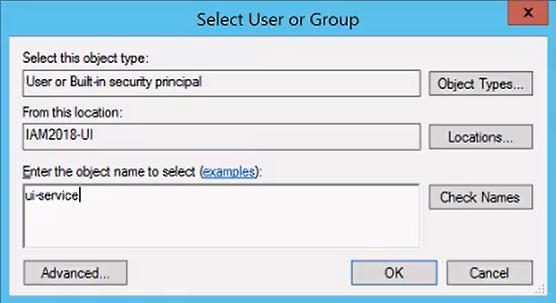

1. Now, select the “Server Roles” on the menu on the left and select also the “sysadmin” role for this Service Account, click on “OK”. You can now close the SQL Management Studio application.

   

1. On the UI interface, now under Database Server configuration step, you will be prompted to provide the Server Name (sometimes it could be the local machine). For this case, it is the name used when installing the SQL Server 2016 (“.\UniversalInvent”). Select the Authentication Mode, type in the Service Account username and passwords and click on “Verify”. If all is correctly configured, you should see the checkmark on the left for the Database Server. Now, click on “Next”.

   

>[!TIP]
> Check the "Additional Tips" section further down on this page for more information about this tab.

1. At the “Work Folder” stage, you will need to select a folder where all UI scripts, logs and other files will be stored. Click on “Select Folder” to choose the location. Look for the checkmark on the left to ensure it is configured correctly and click on “Next”.

   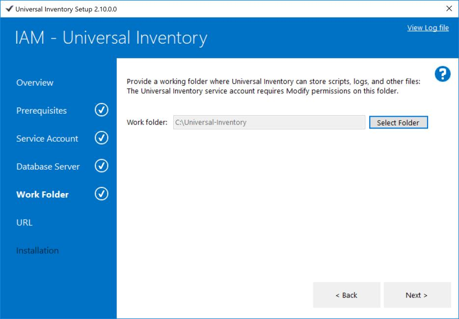

>[!TIP]
> Check the "Additional Tips" section further down on this page for more information about this tab.

1. On the next screen you will need to select the correct ports that the system will use for communication.This step is necessary because one could have different configuration set-ups such as running everything locally or having another server connecting to UI using one specific port. If the Customer wants to have another port defined that is not the default one (localhost:10940), that is okay. Click on “Verify”, make sure the check mark is shown under the URL stage and click on “Next”.

    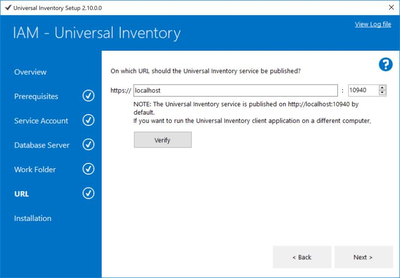

>[!TIP]
> Check the "Additional Tips" section further down on this page for more information about this tab.

1. Review the components Summary and click on “Install”. UI will only start changing configurations of the system once this “Install” button is pressed.
1. Now UI will create the database on the database Server and Instance, which contains an UI central data store and an additional store with configuration parameters, also will install and, by default, when you click on “Exit” it will launch the UI Client application.

   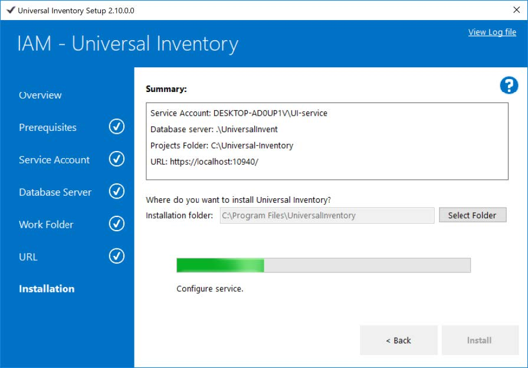

   >[!TIP]
    > If you get a “You are not connected” error when the UI Client Application is launched, you will need to validate that the connection settings are correct. To do so, click on “Settings” and make sure that the connect address and port are the ones you specified during set-up and click on “Test”. If you see in green “Connection Successful” it means that you are all set. Click on “OK”. You will then be prompted to restart the UI Client application. Once it restarts, you will see a screen showing that you have no projects created.

   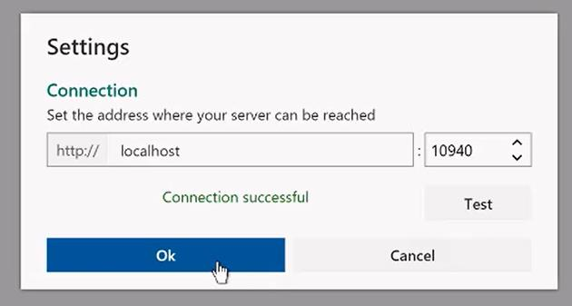

   Now you are all set up to start creating a CIDC using Universal Inventory.

## Additional Tip: Database Server

On the **Database Server** page, enter the name of the Universal Inventory database server you provisioned earlier.  

Choose **Windows authentication** if you created a Windows login on the database server for the Universal Inventory Service Account.  
Choose **SQL Server authentication** if you created a SQL account on the database server, and enter the credentials of the SQL account.  

Click **Verify** to check that the service account can login to the database server as sysadmin. A check mark appears next to **Database Server** in the left pane.

Click **Next >**

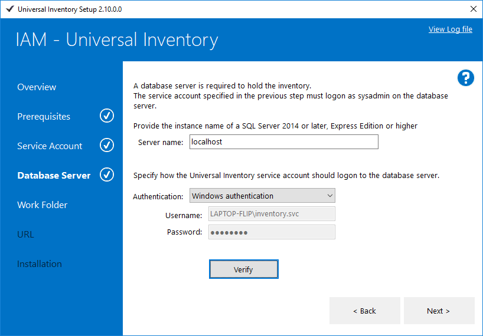

## Additional Tip: Work Folder

On the **Work Folder** page, specify the path to a folder where Universal Inventory can store files. A check mark appears next to **Work Folder** in the left pane.

Click **Next >**

## Additional Tip: URL

On the **URL** page, specify the URL and port where the client can reach the service. If you intend to use the client on a different computer than the service, you have to enter a fully qualified name or IP address. If not, you can use *localhost*.  

Click **Verify** to check that the URL is a valid name or IP address, and that the TCP port is  available. A check mark appears next to **URL** in the left pane.  

Click **Next >**

## Additional Tip: Settings

Once the UI app is open, the **Settings** menu will bring up a dialog where you tell the UI client application where it can find the UI service.

- Enter the URL and port number where the UI service is installed. These were specified during [Installation](installation.md).
- Click **Test** to verify if the service can be reached at the specified URL.
- The OK button will be enabled only if the connection was successful. Click **OK**.

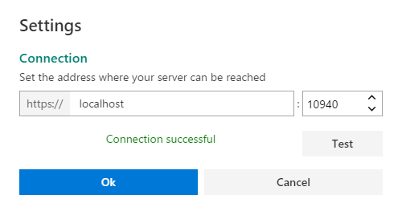

- The client application must be restarted to confirm this settings. Click **OK** to restart the client.

> [!NOTE]
> When you start the client application you might see a message that \"you are not connected\".  This means the connection setting is wrong *or* the UI service is not running.
> The **Settings** button in this message will bring up the Connection settings screen.
> 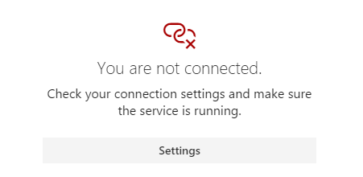

## Next Step: Best Practices for Quality Inventory

Now that you have installed Universal Inventory on the customer environment, read the [**UI Best Practices for Quality Inventory Tutorial section**](quality.md) to learn some benchmark practices that Microsoft recommends that ensures your final SAM deliverables will contain high quality and valuable data-insights.