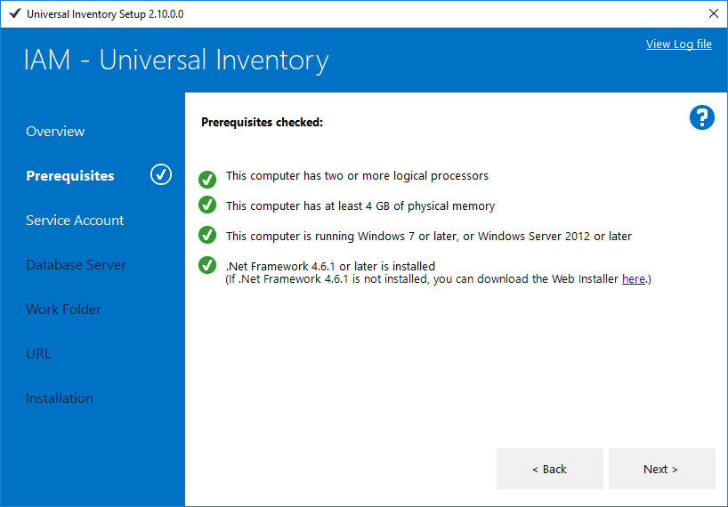
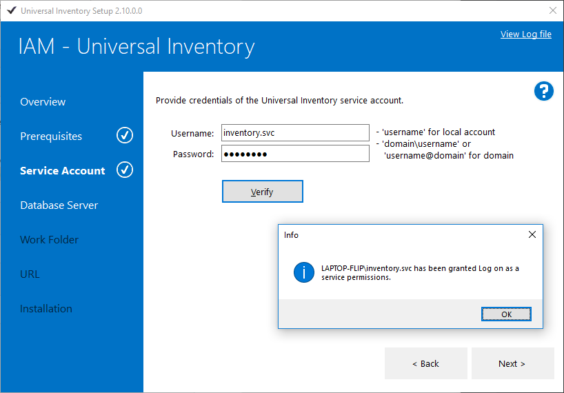

# Install Universal Inventory

Start UISetup.exe **in administrative mode**.

- If a previous installation of Universal Inventory is detected, UISetup allows you to uninstall it.  
  If the version of the previous installation is lower than the version being installed, UISetup allows you to upgrade the existing installation.

- If no previous installation is detected, UISetup displays the **Overview** page to start a first-time installation.

- Click **View Log file** in the top-right corner at all times to bring up a log file that can help in troubleshooting any issues that occur during upgrade or installation.

## Overview

On the **Overview** page, verify that all preparations have been made. Read [Preparations](preparation.md) for more info.

Click **Next >**

## Prerequisites

On the **Prerequisites** page, verify that all prerequisites are met. There should be a green check mark next to each prerequisite, and a check mark next to **Prerequisites** in the left pane. Read [Prerequisites](preparation.md#prerequisites) for more info.  

Click **Next >**

## Service Account

On the **Service Account** page, enter the credentials of the Universal Inventory Service Account.  
For a local user account, enter the user name only.  
For a domain account, enter the logon name in the format `domain\username` or `username@domain`  

Click **Verify** to check that the service account can logon using the specified credentials, and to grant it the *Logon as a Service* permission. A check mark appears next to **Service Account** in the left pane.  

Click **Next >**

## Database Server

On the **Database Server** page, enter the name of the Universal Inventory database server you provisioned earlier.  

Choose **Windows authentication** if you created a Windows login on the database server for the Universal Inventory Service Account.  
Choose **SQL Server authentication** if you created a SQL account on the database server, and enter the credentials of the SQL account.  

Click **Verify** to check that the service account can login to the database server as sysadmin. A check mark appears next to **Database Server** in the left pane.

Click **Next >**

## Work Folder

On the **Work Folder** page, specify the path to a folder where Universal Inventory can store files. A check mark appears next to **Work Folder** in the left pane.

Click **Next >**

## URL

On the **URL** page, specify the URL and port where the client can reach the service. If you intend to use the client on a different computer than the service, you have to enter a fully qualified name or IP address. If not, you can use *localhost*.  

Click **Verify** to check that the URL is a valid name or IP address, and that the TCP port is  available. A check mark appears next to **URL** in the left pane.  

Click **Next >**

## Installation

On the **Installation** page, verify your settings and specify the folder where the Universal Inventory service should be installed. The Install button is enabled if all checks passed successfully.  

Click **Install**. A progress bar appears to show the installation is ongoing.  

After the installation completes successfully, select the **Launch Universal Inventory** checkbox if you want to start Universal Inventory.

Click **Exit**

## Settings

The **Settings** menu will bring up a dialog where you tell the UI client application where it can find the UI service.

- Enter the URL and port number where the UI service is installed. These were specified during [Installation](installation.md).
- Click **Test** to verify if the service can be reached at the specified URL.
- The OK button will be enabled only if the connection was successful. Click **OK**.

- The client application must be restarted to confirm this settings. Click **OK** to restart the client.

> [!NOTE]
> When you start the client application you might see a message that \"you are not connected\".  This means the connection setting is wrong *or* the UI service is not running.
> The **Settings** button in this message will bring up the Connection settings screen.
> 