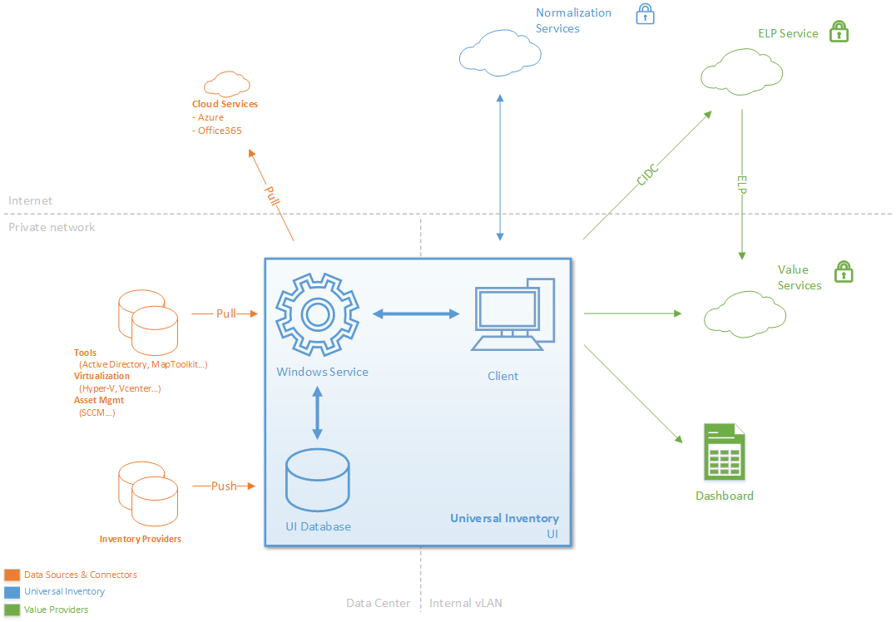

# Tutorial: Universal Inventory Introduction

After learning about the Universal Inventory workflow at the [UI Overview ](../../Overview/UI.md) section, this introduction will give you the main terms and components you should know before starting to work with the UI app.

## Terminology

​​**Stakeholders​**

- **Customer​**: Organization that uses Microsoft software and wants to optimize their investment in software from Microsoft and other vendors through the use of UI.
- **Inventory Consumer​**: ​​​ISV (Independent Software Vendor) that produces a Connector to push inventory data from their respective solution into UI.
- **Inventory Provider​​​​​**​: ​​ISV (Independent Software Vendor) that consumes standardized inventory data from UI to provide Value Services.
- **Microsoft​**: ​Responsible for producing, providing, and supporting UI.
- **​SAM Partner**: ​Microsoft SAM Certified Partner (IT Service Provider) engaged by the Customer to assist with Software Asset Management.
- **UI ​User**: ​Customer or SAM Partner staff that works with UI in the Customer's IT environment.

**Universal Inventory Terms​​**

- **Connector​**: A piece of code to import data from a specific Data Source into UI. We distinguish: <ul><li>Push Connectors are defined and executed on the Inventory Provider's solution and push data into UI.</li><li>Pull Connectors are defined an executed on UI to pull data from a Data Source.​</li></ul>
- **Data Source​**: Source of data in the Inventory Provider's solution where data is imported from.
- **Inventory​**: All collected information about a Customer's IT assets, stored in the UI Database.
- **Project**: Unit used in UI to manage a SAM engagement. Users need to create a new Project or open an existing one in UI to work on a SAM engagement.
- **UI Database**: Microsoft SQL Server database that stores the Customer's Inventory. Each Project has its own UI database.A UI Database has 3 schemas:<ul><li>Import Schema [in]: tables and procedures to upload data into UI</li><li>Permanent Data Store [dbo]: tables that permanently store the Inventory</li><li>Output schema[out]: tables and procedures used to consume UI data</li></ul>​ 

## Components

Universal Inventory consists of 3 components:

- A **Windows Service** that does the actual work of collecting data and maintaing the data store
- A **Client application** to manage the Service and produce output
- The **UI Database** holding the Customer's Inventory.

All 3 components can be installed on a single device. Consultants that work on-site with Customers on short-term engagements may want to install all components on their laptop. Enterprises that address SAM as an ongoing discipline may want to install the UI Windows Service in their datacenter, the Client on an administrator's desktop, and the Data Store on a dedicated database server.

Every time the user creates a UI Project, a UI Database is created. UI Database are owned and managed by the Customer. The Customer decides which Inventory Consumers can access his inventory to provide value services. No data is exported without his consent.

UI will not scan or collect data directly. Instead it relies on *Connectors* to connect to existing Data Sources.

## Raw Inventory Data Input - Connectors

A Connector imports data from a specific Inventory Data Source (Tool/Service) into the Customer's UI Database. Connectors are implemented as scripts so they can easily be reviewed and tweaked by the Customer.

Two types of connectors exist:

- **Pull connectors** pull information from a Data Source. They are managed and executed by UI. Pull connectors currently exist for Active Directory, Azure, MapToolkit, Office 365, SCCM, and vSphere.
- **Push connectors** push information from a Data Source. They are built by Inventory Providers, executed through the Inventory Provider tool, and push data directly into the UI Database. To access the full list of Inventory Providers, please access the [official IAM page](https://aka.ms/samiam).

## Standardized Inventory Data Output - Value Analysis

The Universal Inventory standardized data can be consumed in the following ways:

- By Inventory Consumers Partners that provide additional **Value Analysis and Data Visualization** through their Tools and Services. To access the full list of Inventory Consumers, please access the [official IAM page](https://aka.ms/samiam).
- Through reports provided in UI/IAM Cloud.
- By accessing the UI database directly using tools such as Excel.
- By the **ELP Service** provided by Microsoft to generate a validated License Position based on the Customer's UI Inventory.

## Next Step: Preparing to install Universal Inventory

Now that you are familiarized with the UI terms and components, read the [**UI Preparation Tutorial section**](preparation.md).
