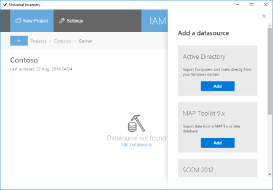
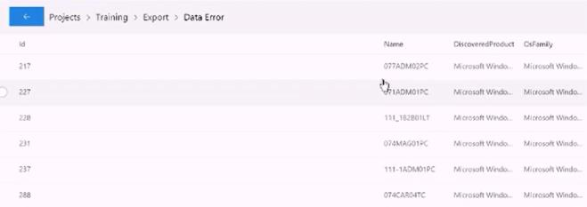

# Create an inventory

After Universal Inventory is [installed](installation.md), follow these steps to create an inventory of the infrastructure:

> [!TIP]
> If you prefer a video guided training for learning how to create the standard inventory document (CIDC) using UI, you can also watch the [IAM 2018 Session 3: Creating a CIDC Using Universal Inventory](https://aka.ms/IAMSession3).

## Create a Project

Use the **IAM-UI** shortcut on the desktop to open the Universal Inventory client application. *No projects yet* will be displayed the first time the application is launched.

Many projects can be created in Universal Inventory. Every Project corresponds with an *inventory*, and can have many *data sources*. An organization with a complex infrastructure may consider creating a test project to validate correctness and verify data source availability, before creating a production project to be shared with value providers. SAM Consultants may create a project for each customer, provided customers consent to their data being stored on the consultant's machine.  

First you must create a project.

1. Click **New Project** in the top-left corner of the screen and enter a name for the project. A valid project name consists of alphanumeric characters and spaces only, and is between 3 and 64 characters long.

2. Click **Save**. An inventory database is created on the database server and a *project card* displays the status of the project and last update time.  

   

3. Click **Open Project** in the project card. The project board displays available actions and reports.  
  
  

## Gather

There are two ways to gather data into your inventory:

- Use connectors available through UI
- Use connectors available from 3rd party providers

The quality of your inventory depends largely on the completeness of the data it contains. Consider as much sources of data to come to a complete inventory. Organizations running Windows domains may want to combine data from Active Directory with data from their virtualization system, an IAM-certified discovery tool, and any cloud subscriptions.

This next section explains how to set up a connector available through UI:

1. Click **Gather** in the project board. *Data source not found* will be displayed the first time the Gather screen is opened for a project.  
  
  

2. Click **+ Add** in the top right corner of the screen. A list of connectors available in UI appears to the right.  
  
  

3. Scroll through the list of available connectors and click **Add** on the appropriate connector. Depending on the type of connector selected, an **Add data source** dialog will show up allowing you to enter the parameters required to connect to the data source.  
  
  E.g. selecting the MAP Toolkit 9.x connector will bring up the below dialog allowing you to specify a Microsoft Assessment and Planning Toolkit database as source.

  

  Enter the parameters required to select and make a connection to the data source. When connecting to a database server, select the blue Refresh button to reveal a list of databases available on the server and select one.

  The **Tenant/Site** field is optional. At a later stage this field allows you to limit data in reports. E.g. geographically dispersed organizations might specify a site name to be able to only report on data from a specific site. Internet providers might specify a tenant name to be able to only report on data from a specific tenant. Multiple data sources can have the same Tenant/Site value.  

  > [!IMPORTANT]
  > Remember that Universal Inventory runs as Windows service. When you select 'Windows Integrated' authentication, it will not be the current user that connects to the data source to import data, but the [service account](installation.md#service-account) of the Universal Inventory service.

4. Click **Add** in the Add data source dialog. The data source configuration is saved and a *data source card* displays the status of the data source and last update time.

5. To import data from the data source into the inventory, click the cog wheel on the data source card and select **Run** from the dropdown-menu. The status of the data source will change to *Running*. After the import is completed, the status changes to *Complete*.  

  If the data source status is *Failed* or *Partial*, open the log file to troubleshoot. The log file is in the [Work Folder](installation.md#work-folder) you specified during installation. If the information in the log file does not allow you to solve the issue, turn to [IAM Support](https://www.intelligentassetmanager.com) for help.

## Verify: Creating a Clean Inventory Data Contract (CIDC) with Universal Inventory

The Clean Inventory Data Contract (CIDC) is an Excel report used as the required template to pull in and consolidate raw inventory data from the various inventory and discovery tools, de-duplicated, and formatted to work with the main IAM site. Some manual usage and license allocation inputs will also be required to complete the CIDC. Once uploaded, the CIDC is validated against business rules to ensure proper data collection. If the CIDC fails validation a CIDC Error report detailing what needs to be fixed will be created.

1. On the Customer’s machine, open the Universal Inventory client application that was just created. It will launch with a standard blank screen because no Projects are defined yet. With this solution the Customer can create multiple projects for themselves, UI can be a component to be used without any specific Microsoft Engagement running.

   

1. Click on “New Project”, type in the Project name and click on “Save” button. The system will create the Project database, taking into account the data stored in UI database as a starting point. You know the Project was created successfully when you see this screen:

   

1. Click on “Open Project” and you will see standard interface with the Actions and Reports that can be performed through UI.

   

1. Click on “Gather” to configure the data sources that need to be configured for this Engagement. To add new data sources for an Engagement you currently have to options:
    - Use a “Pull Connector” to reach out to the data sources maintained by Microsoft (Active Directory, MAP Toolkit, SCCM 2012 and/or vMWare vCenter (Office 365 will be added shortly); OR
    - Use to “Push Connectors” to automatically push the data scanned through the Inventory Tools/Services from the UI-integrated Vendors (ISVs).

1. For the first option of a “Pull Connector”, click on “Add” button and choose which data source is preferred:

   

1. This guide will showcase a MAP Toolkit integration as a data source, so click on “Add” under the MAP Toolkit option. Type the Sever name that contains the MAP data base instance and select the type of Authentication. Then, click on the blue Refresh button and the system will update with all Database names contained in this server under the “Database” drop-down menu. Select the preferred one. As an option, you can also define the “Tenant/Site” name. This is useful when more than one MAP database is included, so that later reports can be run for a specific Tenant from a MAP database. Click on “Add”.

   

1. A “Pull” connection will be created. Click on “Run” to pull the database from this source, you will see the status change to “Complete” in green, which means this selected environment was scanned and pulled into UI.

   
   

1. Go back to the Project dashboard and this time select “Verify” to check a list of information about the devices scanned.

   

1. At the Verify tab, you will notice some options available for checking the database imported. On the “Column” filter, you can select which columns you would like to see on the report. To exclude certain parameters on both Devices and/or Users from your final CIDC file, select the row by clicking on the blue “Checkmark” on the left portion of the and then click on “Exclude” under the “Action” drop-down.

   

1. In case you wish to add a “Push Connector”, within this guide we will show you an example of how that can work through the LanSweeper UI-integrated application since they were one of our first Tool Partner to integrate with UI. When the LanSweeper application is ran, the start screen shows an option to Export the inventory to Universal Inventory.

   

1. Fill out the information related to your Universal Inventory server created and follow the steps within their application. The correct “Connect to Universal Inventory” Database name to be used is displayed on the Project Dashboard (see example below). Also, the Datasource ID should be provided by Lansweeper. Click on “Connect” and then on “Start” and the Push connector will start working to push your Lansweeper scanned data into your Project created within UI.

   
   

1. Once the export is completed it will be communicated through a pop-up window and you can finalize this process by clicking on “Ok”.
1. To verify if your data is now available on your UI Project, go back to “Gather” option on the initial Project dashboard and verify that the “Push” inventory is available.

   

   >[!IMPORTANT]
    >If you see that any of the data sources included on your Project contain “Import Warnings” in yellow, it means that your data is missing important data points that will ensure a minimum quality standard on your CIDC. Click on the yellow message to read more information about which data is missing. Make sure that data is corrected before creating your CIDC so that you comply to these minimum standards recommended by Microsoft.

1. Once you have finalized pushing and pulling from all the data sources you used to scan your Customer’s environment, you can verify all the data included in UI through the 3 different Reports available on the Project dashboard. Once you are certain that the data from the Push and Pull connectors are correct and all the right Devices and Users are available, you should proceed to the Refinement step, accessed through the “Refine” button on the Project dashboard.

   

   Refinement step, also known as “normalization”, de-duplicates and normalizes product naming from the various disparate inventory data collection solutions. Inventory collection tools contain their own product naming standards, and in order to have one single inventory format standard, refinement merges these into a single, standardized universal dataset that is easily to understand.  
   For IAM 2018, Microsoft is partnering with leading SAM Tools providers who have demonstrated best practices within their refinement/normalization solutions to offer no cost services for Engagements being processed through IAM. Refinement service offerings will expand over time. Refinement service providers may have their own set of Terms and Conditions for users.

   The IAM 2018 launch partner for Refinement is Snow Software. To learn more about Snow’s normalization solution, [click here](https://www.snowsoftware.com/int/solutions/data-normalization-cleansing-0).

   During refinement, a very limited amount of data collecting during inventory gathering is shared. Data fields that could contain PII are not transmitted. This table contains the data sent during refinement:

   | Data send for refinement | Example of data                  |
   |:--------------------------:|:----------------------------------:|
   | Software vendor          | Microsoft Corporation            |
   | Application path         | c:\program files\test\office.exe |
   | Application name         | Office 2013 Professional         |
   | File size                | 12000 mbs                        |

1. Click on “Refine” under the Snow service that is shown as available.

    

1. Because it’s a no-cost service, you will need only at the first time do a short registration at Snow’s application. Click on “Sign up with Microsoft” and you will be requested to sign up with your Microsoft Work or School Account (Office 365 or Azure). You will then be redirected to a screen to type your Account and Password and then click on “Sign in”.

   

1. The next screen will request your consent to forward your UI identity to Snow Software on the normalization App that you will be using. Read the terms on the window and click on “Accept”. You will then see that the UI application has been granted the necessary rights within the Snow’s normalization application and click on the green big “checkmark”.

   
   

1. Fill out a quick registration regarding your Customer and click on “Submit”. Read the Snow’s End-User License Agreement and click on “Accept” to finalize the set-up for the normalization service from Snow.

    

    

1. When the refinement is finalized by Snow’s application, a data timestamp will show on the box, as well as the green “Completed” note. 

>[!NOTE]
 > When you have products that are not recognized immediately by Snow, those are processed by Snow’s normalization team and made available on the UI app within the next 24 hours.

20. To check on the normalization work that has been completed, go back to the main Project dashboard and click on “Summary”. On the report, you will see the “Distinct software titles and versions” as the total count within the raw data and “Normalized software titles” with the total count after the normalization process.  
   
> [!TIP]
> You can also see the reports “Devices” and “Users” for more detailed information about them.

   

21. To finalize your inventory collection for a Microsoft SAM Engagement, you need to create the Universal Inventory CIDC. Click on the “Export” button on the Project dashboard and you will see the option to create a Microsoft CIDC. The system will then build the CIDC file and prompt you to select a location for it to be stored. 

> [!IMPORTANT]
> Only Microsoft-related licenses will be exported to this CIDC file. It is the same file that will later be encrypted and uploaded into the IAM platform to finalize your Microsoft SAM Engagement.

   
   

22. If any of your data sources are missing important data, on this screen you will find an error messages with some information about the missing data. If you click on the “Description” for each item, you will see a list of the Devices that contain that specific error. These are important indicators that your inventory is not following the minimum data quality requirements that Microsoft recommends, so it is especially important that you fix them before moving forward with your CIDC creation.

   
   

23. Once you find that your CIDC has sufficient data quality and is ready to be included on IAM for EDP and/or ELP creation, you should open the IAM Encryption/Decryption tool that was installed along with UI_Setup to encrypt your CIDC data. Launch the tool and fill in the “Source CIDC File” by browsing your document on the location it was saved. Then you will have to determine a Password for your CIDC, so the data will only be available for the ones that have this password. Click on “Encrypt” and the CIDC encrypted file will be created in the same folder as the source file, with the same name suffixed with “-Encrypted”.
   - Guideline for CIDC password:
        - At least 8 characters long;
        - Include 3 of the following four below:
           - Uppercase
           - Lowercase
           - Numbers
           - Symbols or Unicode characters

           

1. If you need to decrypt your CIDC, EDP or ELP to visualize the data, on the box “Decryption”, select the Source File and type the same Password used for encryption. Select the file type in the drop-down menu and click on “Decrypt”.

   

1. Additionally, going back to the Universal Inventory app, on the “Export” option in the main dashboard,you will also find other options to export, which are the UI-integrated Value tools that are provided by our Tool Vendors. Our launch partner in providing this integration is UnifyCloud with their CloudRecon Analytics service, that generated Value Engagements reports. When you click “Export”, you will download a backup of your UI database in the standardized UI format that can be uploaded into CloudRecon.  
  >[!NOTE]
  > CloudRecon licenses might be required for using this service.  
  
  > [!TIP]
  > To be able to create a Value Engagement report, CloudRecon will require a full picture of the Customer’s IT environment, not only Microsoft-related licensing information. Therefore, this CIDC downloaded will contain all manufacturers data information.

    

   Once the CIDC is encrypted you are ready to upload to the IAM Cloud platform to run through Steps 2 and 3 to create, respectively, the [Established Deployment Position (EDP)](../SAM-Partners/EDP.md) and, if required, the e[Established Licensing Position (ELP)](../SAM-Partners/ELP.md).
