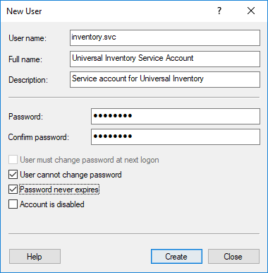
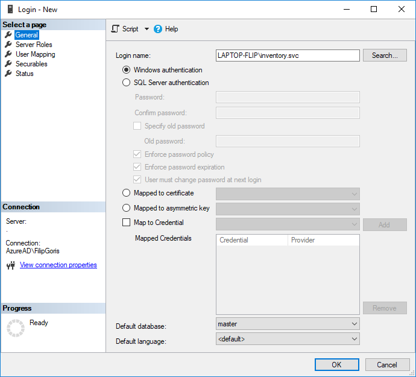

# Tutorial: Preparing to install Universal Inventory

Before learning more about the prerequisites for using UI application, make sure you have read the [UI Introduction Tutorial section](introduction.md), which contains detailed information about main UI terms and parts.

## Prerequisites for Installation

- Physical or virtual computer, with:
  - 2 (virtual) cores
  - 4GB (virtual) RAM
  - Running Windows Server 2012 or later, or Windows 8 or later, Professional or Enterprise edition
  - .Net Framework 4.6.1 or later
  - About 400MB free disk space
  - Must have **Windows OS in English**
- SQL Server 2014 or later, [Express Edition](https://www.microsoft.com/en-in/sql-server/sql-server-editions-express/) or higher instance to hold the inventory databases. This can be installed on the same machine as Universal Inventory or on a different machine. Only Database Engine services have to be installed, but you will need a client such as SQL Management Studio to manage database permissions.  
  >[!TIP]
     > The amount of disk space required for the databases of course depends on the size of your inventory. As an indication, a 2GB database can hold info on about 20.000 devices without performance data.
- Have a service account available (see below for instructions on how to create it)
  >[!NOTE]
    >The **Universal Inventory Service Account** has to have permissions to create and delete databases on the database server.
  > [!TIP]
  > Although the Universal Inventory databases can be installed on an existing SQL Server, we strongly advise the installation of a separate SQL Server instance for Universal Inventory because the **Universal Inventory Service Account** requires administrative permissions on the entire database server, including all other databases that reside on the same server.
- Have a work folder, a folder on the device where Universal Inventory is installed and where logs, exports, and custom scripts can be stored. The Universal Inventory Service Account requires Modify permissions on the Work Folder. Please avoid setting up your Work Folder at a OneDrive location.
- Have an URL and port available where the Universal Inventory service can be published.
  >[!IMPORTANT]
    >The Universal Inventory service is published on [http://localhost:10940](http://localhost:10940) by default. If you want to run the Universal Inventory client application on a different computer, you must replace localhost with a network name that the client computer can connect to.
- Optionally, an outgoing Internet connection on the device where Universal Inventory is installed for:

  - Normalization of inventory data by 3rd party service providers
  - Automatic updates of patches and fixes to Universal Inventory connector scripts (coming soon)
  - Automatic updates of the [Universal Inventory catalog](ui-overview#catalogs) database
  - Version detection and download of the latest version (coming soon)
  - Upload inventory to 3rd party providers of value services (coming soon)

  > [!NOTE]
  > Universal Inventory does not exchange any data over the Internet without your explicit consent.

## Universal Inventory Service Account

Universal Inventory runs as a Windows service. A service account that runs the Universal Inventory service is required. This can be a local computer account or a domain account.

> [!TIP]
> Use a domain account in domain environments to facilitate assigning read permissions on data that will be imported from other computers later.
> [!NOTE]
> The Universal Inventory service currently cannot be run as SYSTEM or NETWORK builtin accounts.

## Prepare a local User Account as Service Account

- On the Start Menu search and open **Computer Management**
- Select **Local Users and Groups** > **Users** in the tree pane, and create a new user\r\n
- It is a good idea to set the **Password never expires** property to prevent that the service stops working when its service account password expires, or follow corporate policies for service account credentials.

  

The Universal Inventory Service Account requires Modify permissions on the Work Folder.

**To assign Modify permissions on the Work Folder:**

- Right-click the Work Folder in Explorer, and select **Properties**
- On the **Security** tab, click **Edit** and **Add...**
- Add the Universal Inventory Service Account
- Select **Modify** in the list of Permissions for Universal Inventory Service Account

The Universal Inventory Service Account requires sysadmin permissions on the database server that will hold the Universal Inventory databases.

## Assign sysadmin permissions on the Database Server

- Connect SQL Management Studio to your database server
- Right-click **Logins** under **Security** in the Object Explorer and select **New Login...** from the dropdown menu.
- On the Login - New form,  
  select **Windows Authentication** and click **Search...** to look for the Login name of the service account  
  -- or --  
  select **SQL Authentication**  and enter a Login Name and Password.

  

- Select **Server Roles** in the left pane, check the **sysadmin** checkbox, and click OK.

  

## Next Step: Best Practices for Quality Inventory

After making sure you have got the Prerequisites for using UI on your computer, read the[**UI Installation Tutorial section**](installation.md).