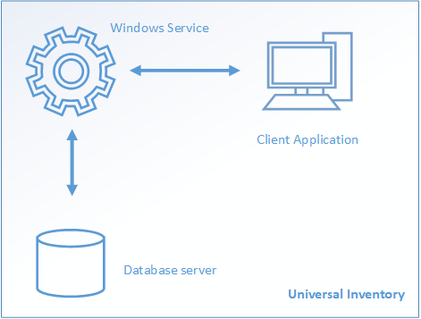

# Overview of Universal Inventory

## Components

Universal Inventory has three components:

- **Universal Inventory client application:** The application you use to manage Universal Inventory: create projects, define data sources, and import, refine, and export your inventory. This is the only visible component you work with.

- **Universal Inventory Windows service:** A Windows service that does the actual work of importing data from several sources, and store it in the Universal Inventory database.

- **Universal Inventory database server:** A SQL Server instance that holds the actual inventory databases as well as other databases:

  - **UniversalInventory** is a single database where Universal Inventory stores the configuration and status of projects, data sources, and other artifacts. This database does not hold inventory data.

  - **UniversalInventoryCatalogs** is a single database where Universal Inventory caches standard names of processors, software titles, and manufacturers.

  - **UI_xxx** databases hold actual inventory data. A new UI_xxx database is created for every Project created with Universal Inventory.  

Components can be installed on the same or on different computers:

- During installation you specify an existing SQL Server instance to be used as Universal Inventory database server. This can be a local or remote SQL Server instance.

- After installation, you can copy the Universal Inventory client application to a separate workstation to remotely manage the Universal Inventory service.

