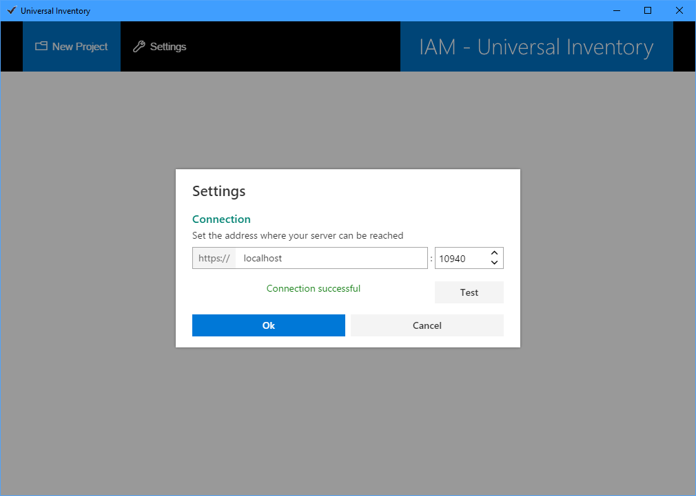
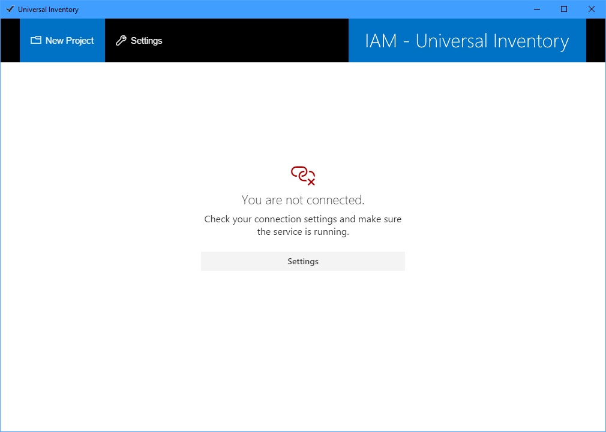

# Settings

The **Settings** menu will bring up a dialog where you tell the UI client application where it can find the UI service.

- Enter the URL and port number where the UI service is installed. These were specified during [Installation](installation.md).
- Click **Test** to verify if the service can be reached at the specified URL.
- The OK button will be enabled only if the connection was successful. Click **OK**.

- The client application must be restarted to confirm this settings. Click **OK** to restart the client.

> [!NOTE]
> When you start the client application you might see a message that \"you are not connected\".  This means the connection setting is wrong *or* the UI service is not running.
> The **Settings** button in this message will bring up the Connection settings screen.
> 